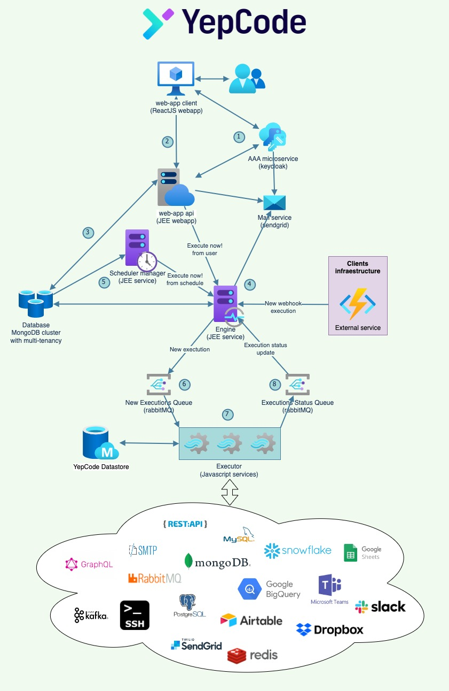

## Discover YepCode technology stack

**_Divide et impera... microservices to the rescue!_**

**_‍_**The planning process for building the **YepCode technology stack** was thorough.We had no doubt about the benefits of creating YepCode using [microservices](https://martinfowler.com/articles/microservices.html) instead of a monolithic architecture: **scalability**, resources **efficiency**, **automating** (CI/CD), **reliability**, **isolated and bulletproof environments**, **maintenance**...

In the following image, you can see **YepCode current microservices architecture diagram**. In the next sections, we'll do an overview of one to tell you about technologies, responsibilities and communications between them.

YepCode services stack

### Before starting, a little bit of DDD, testing, hexagonal architecture, git branching model, CI/CD...

As you may suppose, **in YepCode we are code lovers**, and **we like to create software using high-quality standards**. Some of the principles we apply on every YepCode layer are:

-   **DDD:** We need to understand that Software is not just about code. **Domain-Driven Design** makes sure that every person involved in the project speaks the same language. Sometimes it's hard to communicate but once broken that barrier, information flows and doesn't get lost.**DDD provides a guide to strategic and tactical design.** Strategic focus on business values and tactical on building a battle-tested domain model.DDD also **emphasizes practices like continuous integration.** This ensures the integrity of the entire project, allowing potential problems to be detected on the fly.
-   **Testing:** We want every piece of code to be fully tested. We know that's kind of ideal but we do our best. Every feature has its unit, integration, acceptance and smoke tests. **Develop a function without any test is not acceptable for us**.
-   **Git branching model**: Another of our main Goals is **agility.** For that reason, we choose [trunk-based development](https://trunkbaseddevelopment.com/) as our branching model. With this model, **we ensure that we work in the main branch almost all the time.** And, of course, the main is always production-ready.
-   **CI/CD**: We rely on [Bitbucket](https://bitbucket.org/product) to implement our CI/CD cycles. With each [pull request](https://docs.github.com/en/github/collaborating-with-pull-requests/proposing-changes-to-your-work-with-pull-requests/about-pull-requests), all tests are executed. After a merge into the master branch, new **docker images are generated and published** to our private docker registry. Finally, our **Kubernetes cluster** picks them to **deploy the new versions**.

### Hey, are you still there? Don't lose focus. We are talking about the YepCode technology stack, so let's start with our web-client

**YepCode users only need a web browser to use the platform**. We choose[NextJS](https://nextjs.org/) as our frontend framework because we love it! Probably you already know this but NextJS is based on [ReactJS](https://reactjs.org/). It helps us with tedious initial and production [ReactJS](https://reactjs.org/) configurations.

‍**This is one of our core technologies for other projects**, and the team has wide expertise using it. In the past, we had worked a lot with [Ruby On Rails](https://rubyonrails.org/) or [JEE templates frameworks](https://www.thymeleaf.org/). But in this case, **we pick this framework that allows us to quickly achieve any needed feature**.

We also use [TailwindCSS](https://tailwindcss.com/) to help us managing styles. We could use some preprocessor directly like Sass but that requires a lot of effort to start and maintain. [**TailwindCSS**](https://tailwindcss.com/) **does all for us**. **With very little effort we maintain our code clean and we are very agile.**

We are fortunate to have a **great design staff that ensures that the user experience and design are under control in every change**. To do that, we rely on [Figma](https://www.figma.com/), which allows us to share and discuss any new feature before starting to implement it.

### And, what about the APIs?

When was the time to pick our API language, although there are some other options, we were discussing go for a [Rest API](https://en.wikipedia.org/wiki/Representational_state_transfer) or a [GraphQL API.](https://graphql.org/) And the second one won. We are pretty comfortable with that decision. **We enjoy the flexibility that queries and mutations provide**, only requesting the necessary information in each React component.

Our idea is to open this API to be able to use the full YepCode power as a backend service. In this way, other clients could schedule executions, create processes, review logs,...

### The backend microservices

**The component that serves the GraphQL API acting as an entry point, is a JEE web application,** mainly based on the Spring framework stack. This service is the only one opened to the internet, so **it's also responsible to receive external webhook requests**.

The engine microservice is in charge of **reading and store from the database any information that the executors may need**. It's subscribed to MQ queues where executors publish events (logs, statistics, execution results,...). And also publish events with the executions that need to be processed.

‍**Another critical microservice is the scheduler.** This microservice is in charge of schedule processes and prepare executions to be started at any configured time (defined by a fixed start time or using a cron expression).

‍**The components in charge of running the process executions are the executors**. They receive MQ messages with all the needed information to run a process (source code, parameters, credentials,...). And publish events to report how the processes have finished.

### How AAA has been solved?

We don't like to reinvent the wheel, and since **we have been using** [**Keycloak**](https://www.keycloak.org/) **as an identity and access management solution** for years, we are continuing that approach. This open-source project is our core for authentication, authorization and accounting.

### Persistence: MongoDB to the rescue

Another big decision (maybe one of the greatest dilemmas in every software application), is which solution to use for store the data. A relational database could be used. But the documents that we have to store are quite large, and the most common retrieval is by key. **So, we decided to choose a NoSQL database that stores information in JSON documents as the best option.**

Among all the great software projects that fit that NoSQL approach, we pick [MongoDB.](https://www.mongodb.com/) Mainly by the experience we had with it and because it's one of the core solutions present on the high availability cluster where YepCode runs.

### And what about the metal that allows running all this stuff

We have also been working with [Docker](https://www.docker.com/) and [Kubernetes](https://kubernetes.io/) solutions for years, and we are pretty comfortable with them. **So with YepCode, we keep on with that DevOps solutions.**

In our cluster, we enjoy high availability features. **Each microservice can scale to accommodate any increased workload.** In addition, we have high availability and redundancy in the persistence layer, but we prefer to tell you about this in another article 🤓
