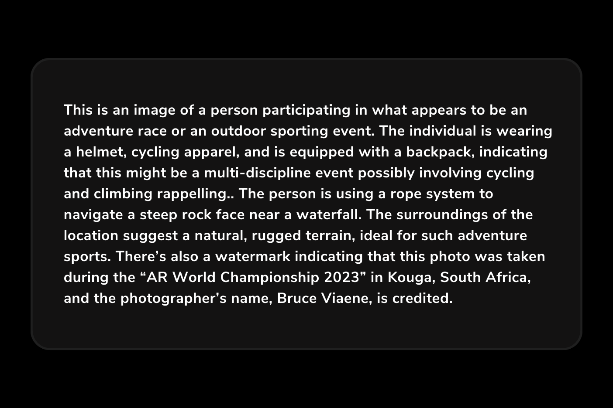

import YouTube from "@components/YouTube.astro";

In the realm of digital communication, images serve as powerful tools for conveying information, evoking emotions and capturing attention.

However, **the significance of image descriptions cannot be overstated**. They play a crucial role in accessibility, SEO and overall user engagement, but sometimes we do not have enough time to write the most suitable words to describe an image correctly, neither the skills.

In this article, we'll explore **how to effortlessly automate the process of generating image descriptions**. Powered by **OpenAI**, this powerful alliance promises **a seamless experience in image-to-text conversion**.

## Demystifying AI Image Descriptions Generation: YepCode's Approach

We use the power of AI to analyze and interpret visual content, **extracting meaningful information and translating it into natural language descriptions**. This image description generation process involves several key steps:

### Creating YepCode Forms for Image Descriptions

YepCode streamlines the process by [allowing users to define input parameters using a JSON schema or a user-friendly builder](/blog/introducing-yepcode-forms-easy-embedding-process-executions). In this instance, our form prompts users with a single question—what information do you want about this image? Additionally, users can upload an image file in BASE64 format.

### Rendering the Form

Upon rendering the form, YepCode extracts the parameters from its context and parses the image in BASE64 format. This prepares the image for integration with the OpenAI API, with the additional requirement of providing the API KEY.

### Integration with OpenAI API

The magic happens when YepCode seamlessly integrates with the OpenAI API. By providing the API key, users unlock the potential of AI-powered image understanding. **AI algorithm analyzes the uploaded image, identifying objects, scenes and activities depicted within the visual content**.

Marcos, YepCode founder in the AR World Championship 2023

### Generating Descriptions with Confidence

OpenAI's prowess shines through as it **analyzes images and generates human-readable phrases** with confidence scores. The algorithm produces multiple descriptions based on various visual features, ensuring a comprehensive understanding:

-   **Semantic Understanding:** Beyond object detection, Open AI delves into the deeper meaning of the image, comprehending the relationships between objects, the emotions conveyed, and the overall context of the scene.
-   **Natural Language Generation:** Open AI transforms the extracted semantic understanding into natural language, crafting a descriptive caption that accurately conveys the essence of the image.

These descriptions are then ordered from highest to lowest confidence, providing users with valuable insights.

Example of description generated through AI

### Embedding the Form Anywhere

We go beyond the conventional by enabling users to **embed image description forms seamlessly**. Whether it's a WordPress site, a Webflow page, or any platform that supports HTML code, **YepCode's forms SDK ensures that the user-friendly input parameters form becomes an integral part of the web page**.

YepCode form to generate automatic Image descriptions

## Benefits of AI Image Description Generation

The integration of AI image description generation into content creation and management offers a multitude of benefits for individuals, businesses, and organizations:

-   **Enhanced** **Accessibility**: Automating AI-generated image descriptions, ensures that visually impaired individuals or those using screen readers can fully access and understand the content of images.
-   **Improved SEO**: YepCode-generated image descriptions provide search engines with valuable context, improving the searchability of your images and boosting your website's overall SEO performance.
-   **Engaging Visual Content:** Descriptive image captions add a captivating layer of narrative to images, making them more engaging for all audiences.

## **Real-World Applications of AI Image Description Generation**

Image description technology using AI goes far beyond traditional websites and online content and has a wide scope of application in a variety of industries and scenarios:

-   **E-commerce:** AI image descriptions can provide detailed product descriptions for visually impaired shoppers, enhancing their shopping experience and improving accessibility.
-   **Social Media:** AI-generated captions can make social media posts more accessible and engaging for a wider audience.
-   **Education:** AI-powered image description tools can aid in creating inclusive educational materials for students with visual impairments, providing them with equal access to visual learning aids.

## **A Real-world Use Case**

To illustrate the whole process, we have recorded a **video tutorial explaining how to create a form to upload a photo and automatically get an AI-generated description**, step by step.We submit an image of the last world championship of Adventure Races. OpenAI processes the image in seconds and provides insightful results.

In conclusion, the [collaboration between YepCode and OpenAI](/blog/ai-code-assistant) revolutionizes the landscape of automatic image descriptions. The simplicity, speed and accuracy of this integration not only enhance accessibility but also redefine the way we interact with visual content.

Enjoy the video and happy coding!

<YouTube url="https://www.youtube.com/embed/OEQ2ok2z5tA" title="Describe image using YepCode and OpenAI API" />
