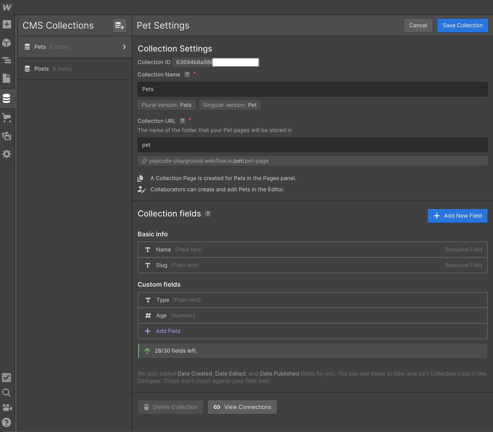
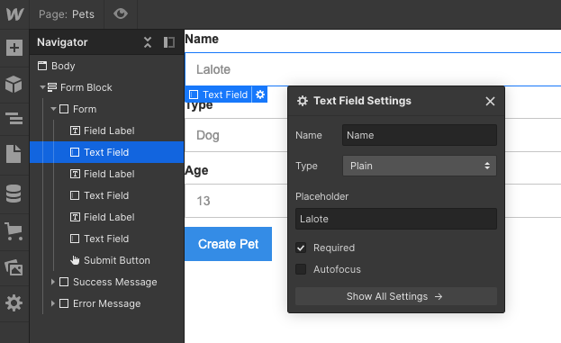
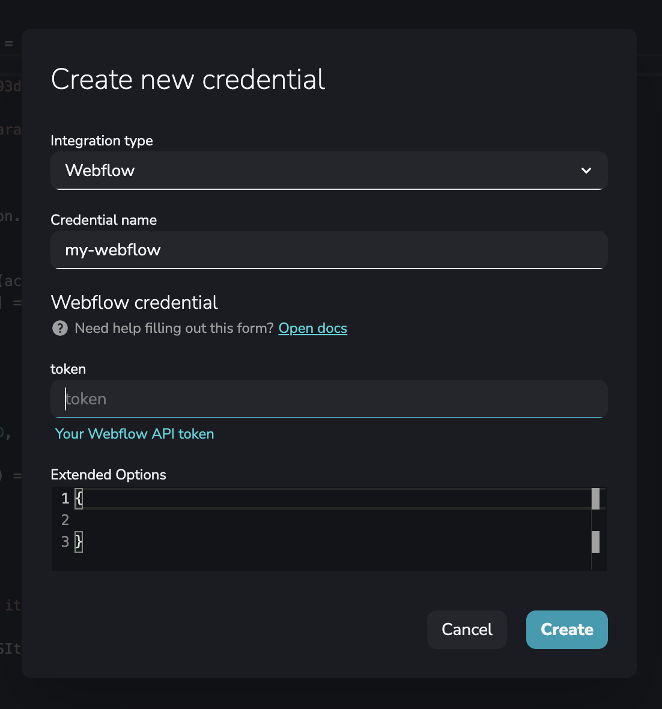
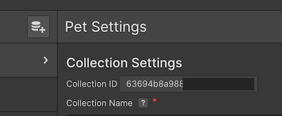
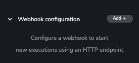
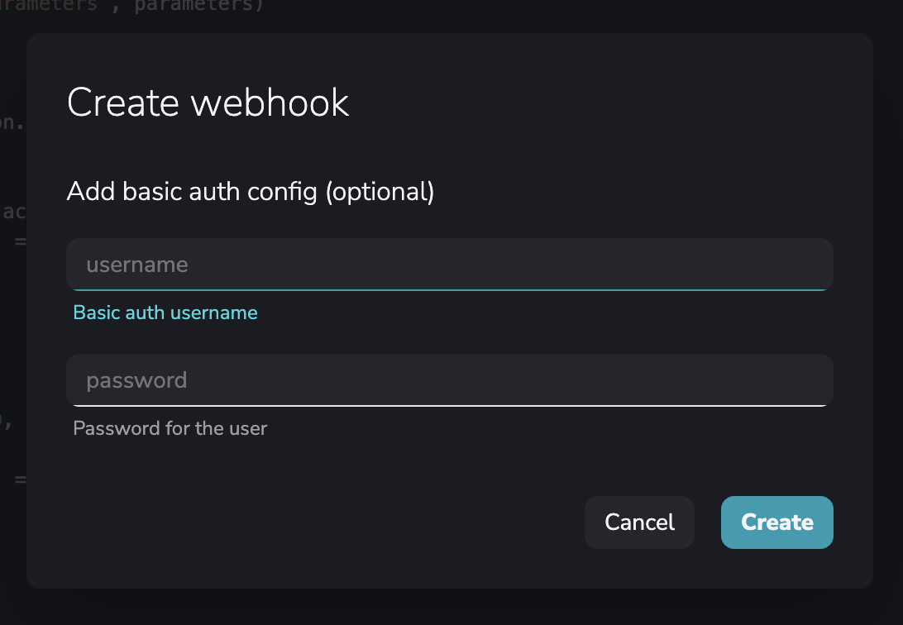
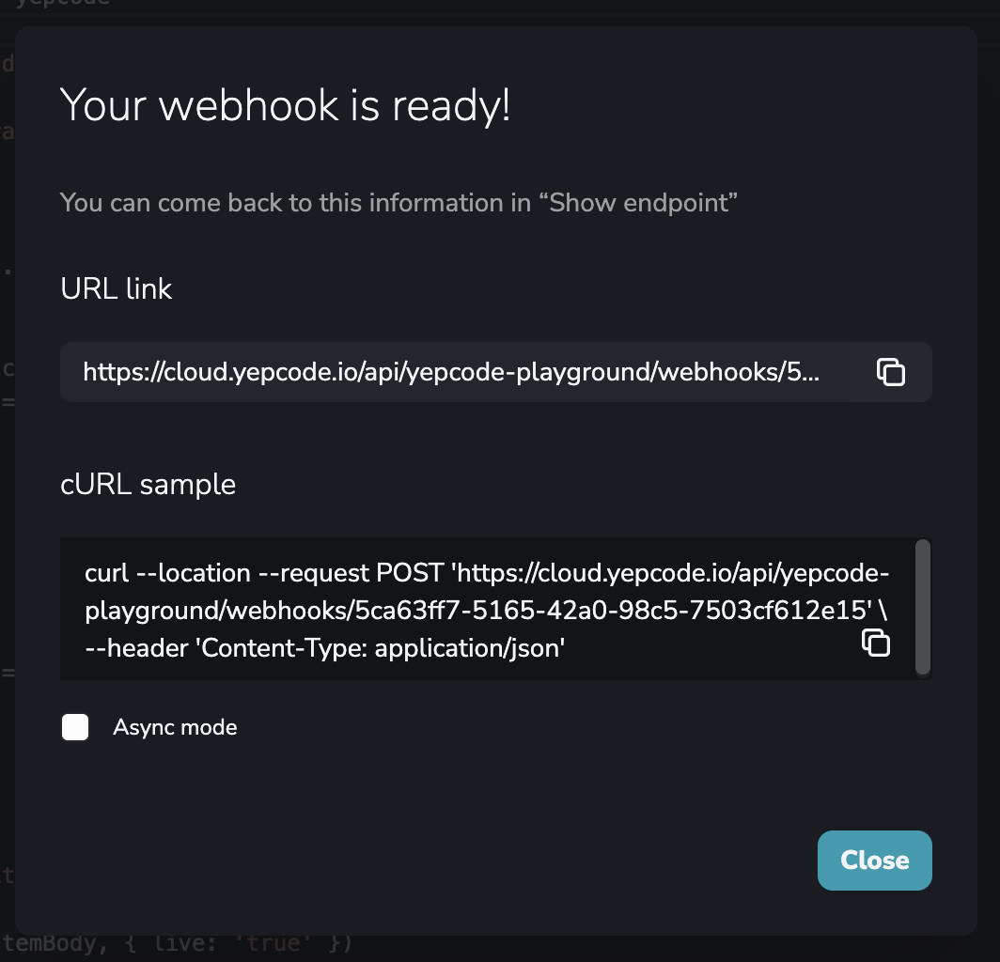
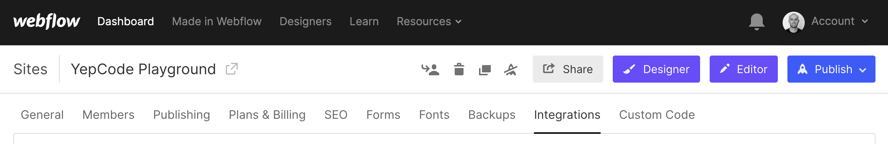
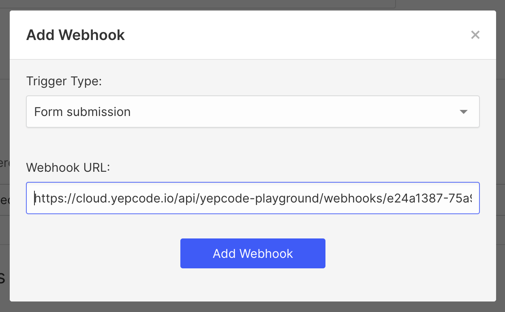

One of the **most requested features missing from Webflow** is the submission of form data to its CMS.

‍**Webflow is a very interesting tool for building websites** in a codeless approach. It **bridges the gap between developers and designers**, as it allows you to create mockups and prototypes in html and css and its drag & drop platform allows you to visualize and manipulate CSS parameters.

Its CMS allows you to create hundreds of pages at a time thanks to its templates and also allows you to build collections to help you develop your business: launching your e-commerce, describing products and building forms to get customers more easily.

With so many features, it would be obvious to think that it would also allow its **CMS to collect the information that a user puts into a form**. But unfortunately, this can't be done directly with Webflow, yet.

## Striving for a smoother flow

Some weeks ago, we migrated YepCode webpage to Webflow, and we are delighted with the result.

We also included the Webflow integration (https://docs.yepcode.io/integrations/webflow/), and a bunch of recipes (https://yepcode.io/recipes/webflow/) to move information to and from this service.

In this post, we'll discuss [one of the most important aspects that Webflow lacks](https://wishlist.webflow.com/ideas/WEBFLOW-I-663). Send form submission data to CMS

The basic steps of this guide are:

-   Create the CMS Entry you want to be managed
-   Create the form in Webflow to ask for the needed information
-   Create a YepCode process that receives that form information and creates using Webflow API the CMS entry
-   Configure Webflow to call the process webhook with each form submission

## Create the CMS Entry

This is up to you. In our case, we are going to create a Pets collection.



## Build Webflow form

Create a new page adding the form. Include a field for each CMS Entry attribute, taking care to use the same name.



## Create the YepCode process

Go to your YepCode account (you may create one for FREE), and create a new process using the following source code.

```js
const _ = require('lodash');

const { context: { parameters } } = yepcode

// TODO: Set your CMS collection id (it's available in Collection Settings window)
const YOUR_COLLECTION_ID = "6366c9..."

console.log(`Received execution parameters`, parameters)

const formData = parameters.data

const webflow = yepcode.integration.webflow('my-webflow');

function toLowerKeys(obj) {
  return Object.keys(obj).reduce((accumulator, key) => {
    accumulator[key.toLowerCase()] = obj[key];
    return accumulator;
  }, {});
}

const createCMSItemBody = {
  collectionId: YOUR_COLLECTION_ID,
  fields: {
    ...(_.mapKeys(formData, (v, k) => k.toLowerCase())),
    "_archived": false,
    "_draft": false
  }
}

console.log(`Creating Webflow CMS item with parameters`, createCMSItemBody)

await webflow.createItem(createCMSItemBody, { live: 'true' })

console.log(`Done 🚀`)
```

You should create a new Webflow credential with name **my-webflow**, and you must generate an [API key for a site](https://developers.webflow.com/#authentication). To do that, open the site in the dashboard and navigate to the "Settings" pane. There is a section titled "API Access", where you can generate a new API key that must be provided in the token field.



You should also configure your CMS collection ID, that is available in your CMS collection page:



After that, you should create a webhook for this process, in order to be called from Webflow:







## Configure Webflow to call the YepCode webhook with each form submission

Go to your project Integrations settings:



And create a new webhook for each Form submission. The URL to be used should be the one that YepCode provides with the webhook creation.



### And that's it!

Just publish your Webflow site and visit the form page. Each submission will instantly create the CMS entry.

### Next steps

This was just a sample use case, but you could complicate it as much as needed, adding more login to the YepCode process: retrieve information from any other service, also store the information in one external database ,etc

Thank you for reading :) and...

Happy coding!
