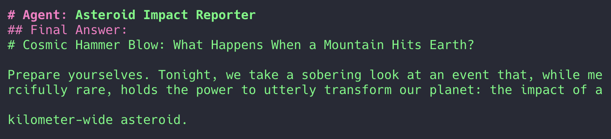
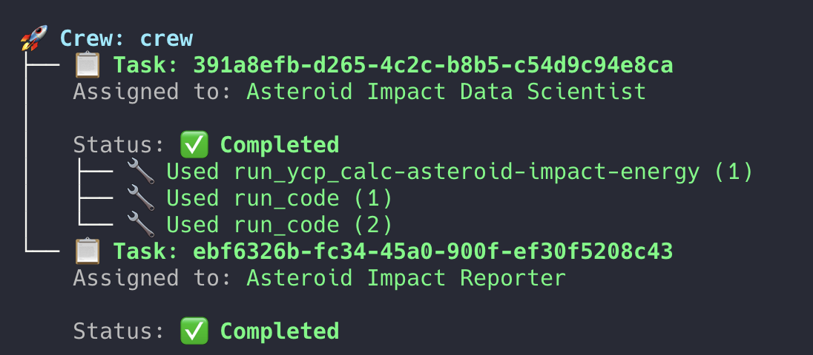

Modern AI agents can do more than just chat—they can reason, collaborate, and even execute real code to solve complex tasks.

> **What if you could combine multi-agent intelligence with cloud-powered code execution?**

In this post, you'll see how to connect [crewAI](https://crewai.com) and [YepCode](https://yepcode.io/) to build a workflow where agents not only think, but act—automating a real-world scenario from start to finish.

### Motivation & Use Case

Why multi-agent systems? Because real-world problems are rarely solved by a single expert—they require collaboration, specialization, and the ability to take action.

> Imagine automating scientific analysis and reporting, end-to-end, with agents that both think and do.

In this demo, we tackle a scenario with real stakes: assessing the impact of an asteroid hitting Earth. (Okay, it's a fun and slightly tongue-in-cheek example—but perfect for showing how agents can combine reasoning, data, and automation to deliver results you can use.)

_No planets were harmed in the making of this post._

### Tech Stack Overview

This project brings together two powerful tools:

\- **crewAI**: Lets you build teams of AI agents that can reason, collaborate, and delegate tasks—just like a real crew.

\- **YepCode**: A cloud platform where agents can run real code, automate workflows, and interact with APIs on the fly.

> **Together, they let your agents not only think, but act.**

### Scenario: Asteroid Impact Assessment

Our agents are on a mission: figure out what would happen if an asteroid hit Earth, and write up a dramatic report.

\- **Asteroid Data Scientist**: Crunches the numbers and calculates the impact.

\- **Impact Reporter**: Turns the data into a story that's fun (and maybe a little scary) to read.

#### Project Setup

Getting started is easy:

1\. [**Clone the repo**](https://github.com/yepcode/crewai-yepcode-demo) and create a virtual environment.

2\. **Install dependencies** with a couple of commands.

3\. **Copy \`.env.example\` to \``.env`\`** and add your API keys.

> You'll need Python 3.10–3.12, plus a free YepCode and OpenAI account.

#### Defining Agents and Tasks

Agents and their goals are defined in simple YAML files:

\- `agents.yaml`: Who does what (e.g., Data Scientist, Reporter)

\- `tasks.yaml`: What needs to be done, and in what order

> Tweak these files to create your own agent teams and workflows!

#### Integrating YepCode

For this scenario, we're using the [YepCode MCP server](https://github.com/yepcode/mcp-server-js)—an ideal fit when agents need to run real code and automate complex tasks.

While CrewAI lets you [create custom tools](https://docs.crewai.com/concepts/tools) directly in your project, using YepCode MCP is even more powerful:

-   You can define, update, and manage your tools in YepCode's platform.
-   Instantly expose new tools to your agents with just a line of code—no redeploy needed.
-   Perfect for scientific tasks, data processing, or any workflow where flexibility and cloud execution matter.

In this project, the **Asteroid Data Scientist** agent uses YepCode MCP to perform calculations. By default, YepCode MCP provides a `run_code` action that can execute any Python or JavaScript code—so your agent can dynamically generate and run code to solve the problem, not just call a fixed API.

> You can also create your own custom tools in YepCode—like a dedicated "Calculate Asteroid Impact Energy" process. (I'll show how to add and use a custom tool in [this post](https://yepcode.io/blog/yepcode-mcp-user-defined-tools-ai-automation), with the code and setup!)

This flexibility is what makes YepCode MCP a perfect match for agent-based workflows.

### Running the Workflow

Just run one command:

You will be prompted with all the crewAI workflow steps in the terminal, showing how agents collaborate to solve the task.

_Steps taken by the crew_

Once the workflow ends you'll get a file like `asteroid_impact_report.md` with the outcome.

_Preview of asteroid\_impact\_report.md file_

### Conclusion

By combining crewAI and YepCode, you unlock a new level of AI automation—where agents can collaborate, reason, and execute real code to solve real problems.

[GitHub Repository](https://github.com/yepcode/crewai-yepcode-demo)‍

> Try the repo, remix the agents, and imagine what you could automate next!Curious to try this for your own API or use case? [Contact us](https://yepcode.io/contact) — we’d love to hear what you’re building.
