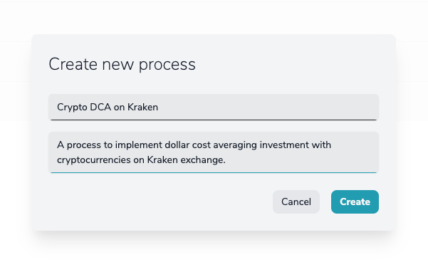
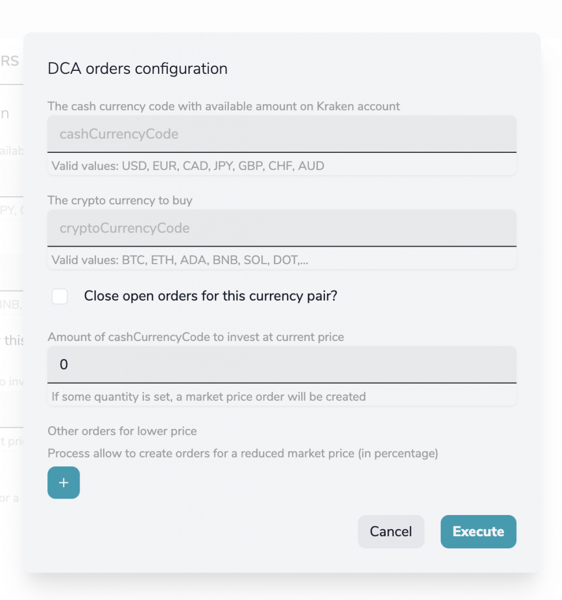
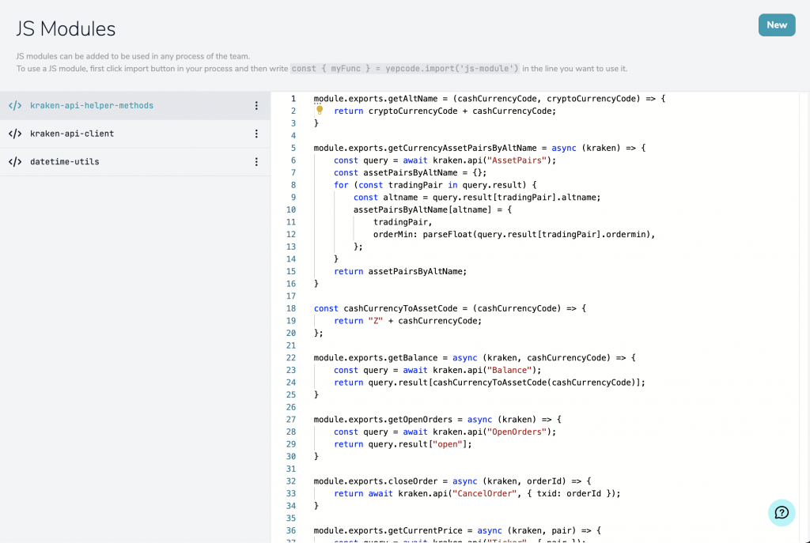
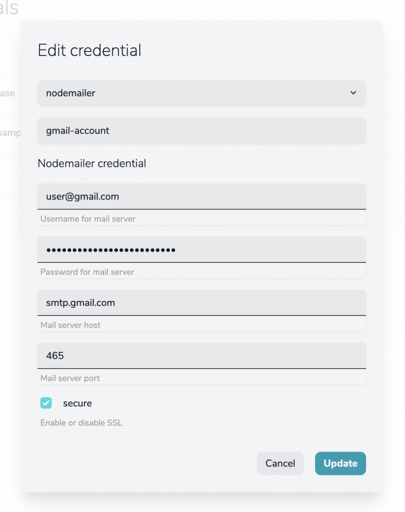
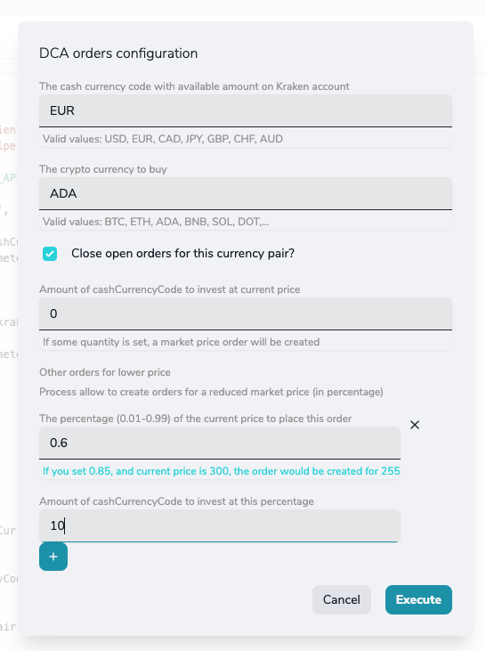
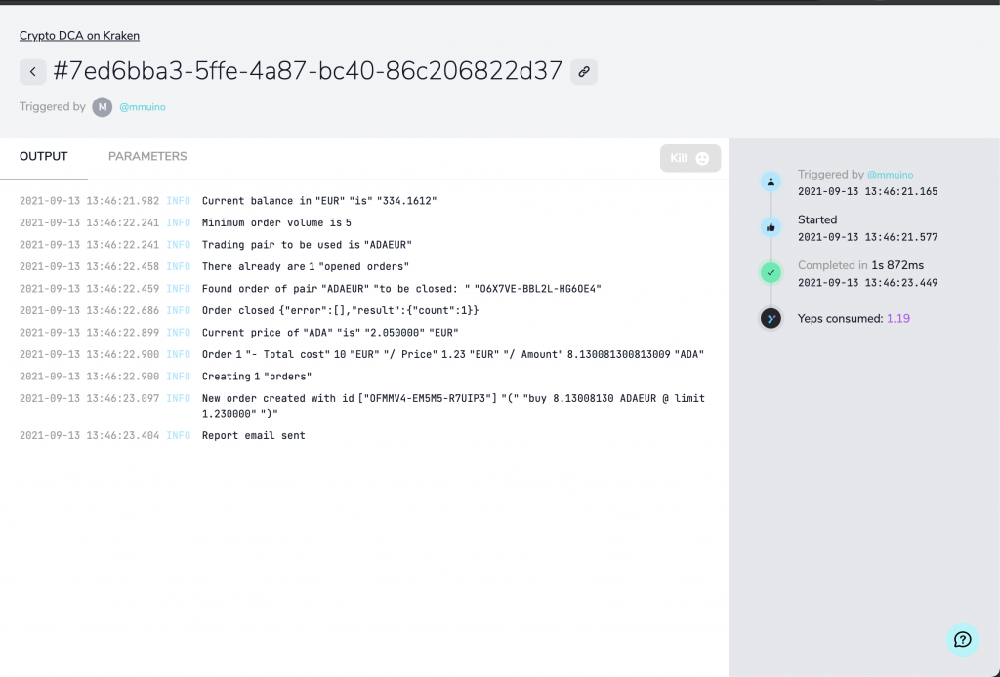
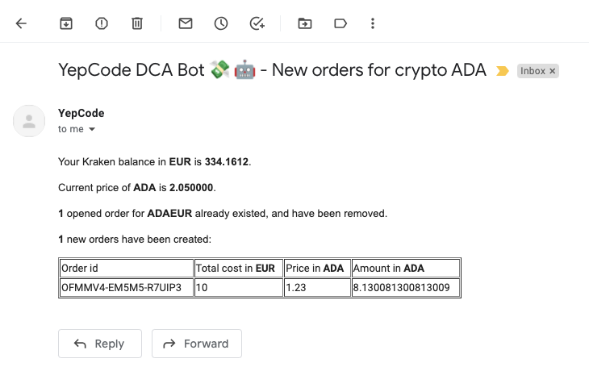
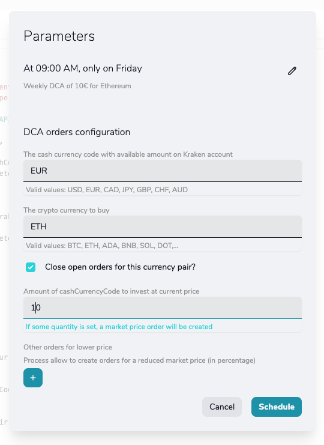

## The word cryptocurrency is no longer just a fad.

For many, the **cryptocurrency universe** is just a hobby, but for many others a way to invest their money.

In this article, we are going to show you how [YepCode could help you](https://yepcode.io/yepcode-universe/why-was-yepcode-created/) to do **dollar-cost averaging (DCA)** investments with cryptocurrencies using the **Kraken exchange**.

Dollar-cost averaging is an **investment strategy** that aims to **reduce the impact of volatility on large purchases of financial assets**. And, for sure, those cryptocurrencies are volatile 💸.

The idea behind DCA is to **spread purchases across predefined intervals, regardless of asset prices**.

You can find lots of information about this strategy ([Wikipedia](https://en.wikipedia.org/wiki/Dollar_cost_averaging), [CoinMarketCap article](https://coinmarketcap.com/alexandria/article/what-is-dollar-cost-averaging)...), or use some tool like [dcaBTC](https://dcabtc.com/) to calculate how this strategy could work with [Bitcoin](https://en.wikipedia.org/wiki/Bitcoin) in the past.

## Strategy is the key to improving your activity with cryptocurrencies

Think that **you want to invest in Bitcoin** and your budget is $500. You could make an **order at today's price**. But maybe **you don't want to invest the whole budget taking the risk that tomorrow the price is lower.** An alternative could be to invest that budget in a fixed period of 5 months, investing $100 a month or $25 a week or $3,33 a day.

If you want **to do this with manual orders in your cryptocurrency exchange, it may be a hard task**. The biggest problem may be that you forgot to do the orders. Or your sentiment about the price at that moment could make that you don't really create the orders, going against the strategy.

A much better approach would be to **automate that order creation tasks, and YepCode is a perfect tool to do that.**

This blog post shows how to create a flexible YepCode process that allows you to do DCA for customers of the popular crypto exchange [Kraken](https://www.kraken.com/), using its [Rest API](https://docs.kraken.com/rest/).

The process accepts the following **parameters** for each execution:

-   Cash currency symbols to be used: **EUR**, **USD**, **GBP**, **JPY**,... (the process doesn't make deposits from banks, so the customer must have enough balance for the order in its **Kraken** account)
-   **Cryptocurrency** **symbols** to buy: **BTC**, **ETH**, **ADA**,...
-   Amount of cash to buy at the current **crypto price**
-   An array of other possible orders at a reduced price (percentage/amount).

If you want to see a more practical approach to this task, you can see this process in our [Sandbox](https://yepcode.io/docs/quickstart/sandbox/), as it's fully configured there with the name **\[Sample\] Crypto DCA on Kraken**. But if your purpose is to learn **how a process can be created in YepCode from scratch**, keep reading as we are showing the steps and linking to the related page in [our docs](https://yepcode.io/docs/).

## So let's stop talking and go for it.

The first step is to create a [new process](https://yepcode.io/docs/processes/):



YepCode supports a [README](https://yepcode.io/docs/processes/the-readme) for each process. For our case, it could be interesting to add some guides about what changes we need in Kraken to allow the process to access your cryptocurrency account.

The README content is a [markdown](https://en.wikipedia.org/wiki/Markdown), and a proposal content could be:

```js
# Crypto DCA on Kraken

This is a YepCode process to implement [dollar cost averaging (DCA)](https://en.wikipedia.org/wiki/Dollar_cost_averaging) investment with cryptocurrencies on [Kraken](https://www.kraken.com/) exchange using its [REST API](https://docs.kraken.com/rest/).

In orther to use this YepCode process, you have to be customer of Kraken, and you have to create one pair of API keys.

## Kraken API keys creation

You can do this with the following steps:

* Login to your Kraken account.
* Visit *Security / API* under user menu.
* Press *Add key* and set the following permissions:
  * Funds:
    * Query Funds
  * Order & Trades:
    * Query Open Orders & Trades
    * Query Closed Orders & Trades
    * Create & Modify Orders
    * Cancel/Close Orders
* Press *Generate Key* and backup your new API keys

More info in [Kraken help](https://support.kraken.com/hc/en-us/articles/360000919966-How-to-generate-an-API-key-pair-)
```

Following this guide, and after having these two keys, we have to create two [YepCode environment variables](https://yepcode.io/docs/processes/team-variables/) to store their values. The name of the variables should be **KRAKEN\_API\_KEY** and **KRAKEN\_API\_SECRET**.

It's time to configure the [input params](https://yepcode.io/docs/processes/input-params/) for the process, allowing the user to provide the cash and cryptocurrencies, to use. And also the amount of cash to spend.

The JSON to configure our input parameterss would be this one:

```js
{
  "type": "object",
  "title": "DCA orders configuration",
  "properties": {
    "cashCurrencyCode": {
      "title": "The cash currency code with available amount on Kraken account",
      "description": "Valid values: USD, EUR, CAD, JPY, GBP, CHF, AUD",
      "type": "string"
    },
    "cryptoCurrencyCode": {
      "title": "The crypto currency to buy",
      "description": "Valid values: BTC, ETH, ADA, BNB, SOL, DOT,...",
      "type": "string"
    },
    "closeOpenOrdersForThisCrypto": {
      "title": "Close open orders for this currency pair?",
      "type": "boolean"
    },
    "marketOrderQuantity": {
      "title": "Amount of cashCurrencyCode to invest at current price",
      "description": "If some quantity is set, a market price order will be created",
      "type": "number",
      "default": 0
    },
    "ordersBelowCurrentPrice": {
      "title": "Other orders for lower price",
      "description": "Process allow to create orders for a reduced market price (in percentage)",
      "type": "array",
      "items": {
        "type": "object",
        "properties": {
          "pricePercentage": {
            "title": "The percentage (0.01-0.99) of the current price to place this order",
            "description": "If you set 0.85, and current price is 300, the order would be created for 255",
            "type": "number",
            "default": 0,
            "min": 0.01,
            "max": 0.99
          },
          "quantity": {
            "title": "Amount of cashCurrencyCode to invest at this percentage",
            "type": "number",
            "default": 0
          }
        }
      }
    }
  },
  "required": [
    "cashCurrencyCode",
    "cryptoCurrencyCode"
  ]
} 
```

As a result, **YepCode could build a form** to be shown to the user on each new execution configuration:



We'll need all the code to **interact with Kraken API**. We could add all the implementation in this same process. But as it seems a quite reusable component, a better idea is to use the [YepCode JS modules](https://yepcode.io/docs/processes/js-modules/) feature to create a new module with a Kraken API client implementation.

Let's create a new Library:


And **fill the source code for the module**, ensuring that we export the desired objects or functions:

```js
// JS module copied, with some minor changes, from:
// https://github.com/nothingisdead/npm-kraken-api/blob/master/kraken.js

const { post } = require("axios");
const { createHash, createHmac } = require("crypto");
const { stringify } = require("query-string");

// Public/Private method names
const methods = {
    public: [
        "Time",
        "Assets",
        "AssetPairs",
        "Ticker",
        "Depth",
        "Trades",
        "Spread",
        "OHLC",
    ],
    private: [
        "Balance",
        "TradeBalance",
        "OpenOrders",
        "ClosedOrders",
        "QueryOrders",
        "TradesHistory",
        "QueryTrades",
        "OpenPositions",
        "Ledgers",
        "QueryLedgers",
        "TradeVolume",
        "AddOrder",
        "CancelOrder",
        "DepositMethods",
        "DepositAddresses",
        "DepositStatus",
        "WithdrawInfo",
        "Withdraw",
        "WithdrawStatus",
        "WithdrawCancel",
        "GetWebSocketsToken",
    ],
};

// Default options
const defaults = {
    url: "https://api.kraken.com",
    version: 0,
    timeout: 5000,
};

// Create a signature for a request
const getMessageSignature = (path, request, secret, nonce) => {
    const message = stringify(request);
    const secret_buffer = new Buffer.from(secret, "base64");
    const hash = new createHash("sha256");
    const hmac = new createHmac("sha512", secret_buffer);
    const hash_digest = hash.update(nonce + message).digest("binary");
    const hmac_digest = hmac
        .update(path + hash_digest, "binary")
        .digest("base64");

    return hmac_digest;
};

// Send an API request
const rawRequest = async (url, headers, data, timeout) => {
    // Set custom User-Agent string
    headers["User-Agent"] = "Kraken Javascript API Client";

    const options = { headers, timeout };

    const { data: response } = await post(
        url,
        stringify(data),
        options
    );

    if (response.error && response.error.length) {
        const error = response.error
            .filter((e) => e.startsWith("E"))
            .map((e) => e.substr(1));

        if (!error.length) {
            throw new Error("Kraken API returned an unknown error");
        }

        throw new Error(error.join(", "));
    }

    return response;
};

/**
 * KrakenClient connects to the Kraken.com API
 * @param {String}        key               API Key
 * @param {String}        secret            API Secret
 * @param {String|Object} [options={}]      Additional options. If a string is passed, will default to just setting `options.otp`.
 * @param {String}        [options.otp]     Two-factor password (optional) (also, doesn't work)
 * @param {Number}        [options.timeout] Maximum timeout (in milliseconds) for all API-calls (passed to `request`)
 */
class KrakenClient {
    constructor(key, secret, options) {
        // Allow passing the OTP as the third argument for backwards compatibility
        if (typeof options === "string") {
            options = { otp: options };
        }

        this.config = Object.assign({ key, secret }, defaults, options);
    }

    /**
     * This method makes a public or private API request.
     * @param  {String}   method   The API method (public or private)
     * @param  {Object}   params   Arguments to pass to the api call
     * @param  {Function} callback A callback function to be executed when the request is complete
     * @return {Object}            The request object
     */
    api(method, params, callback) {
        // Default params to empty object
        if (typeof params === "function") {
            callback = params;
            params = {};
        }

        if (methods.public.includes(method)) {
            return this.publicMethod(method, params, callback);
        } else if (methods.private.includes(method)) {
            return this.privateMethod(method, params, callback);
        } else {
            throw new Error(method + " is not a valid API method.");
        }
    }

    /**
     * This method makes a public API request.
     * @param  {String}   method   The API method (public or private)
     * @param  {Object}   params   Arguments to pass to the api call
     * @param  {Function} callback A callback function to be executed when the request is complete
     * @return {Object}            The request object
     */
    publicMethod(method, params, callback) {
        params = params || {};

        // Default params to empty object
        if (typeof params === "function") {
            callback = params;
            params = {};
        }

        const path = "/" + this.config.version + "/public/" + method;
        const url = this.config.url + path;
        const response = rawRequest(url, {}, params, this.config.timeout);

        if (typeof callback === "function") {
            response
                .then((result) => callback(null, result))
                .catch((error) => callback(error, null));
        }

        return response;
    }

    /**
     * This method makes a private API request.
     * @param  {String}   method   The API method (public or private)
     * @param  {Object}   params   Arguments to pass to the api call
     * @param  {Function} callback A callback function to be executed when the request is complete
     * @return {Object}            The request object
     */
    privateMethod(method, params, callback) {
        params = params || {};

        // Default params to empty object
        if (typeof params === "function") {
            callback = params;
            params = {};
        }

        const path = "/" + this.config.version + "/private/" + method;
        const url = this.config.url + path;

        if (!params.nonce) {
            params.nonce = new Date() * 1000; // spoof microsecond
        }

        if (this.config.otp !== undefined) {
            params.otp = this.config.otp;
        }

        const signature = getMessageSignature(
            path,
            params,
            this.config.secret,
            params.nonce
        );

        const headers = {
            "API-Key": this.config.key,
            "API-Sign": signature,
        };

        const response = rawRequest(url, headers, params, this.config.timeout);

        if (typeof callback === "function") {
            response
                .then((result) => callback(null, result))
                .catch((error) => callback(error, null));
        }

        return response;
    }
}

module.exports = KrakenClient;
```

**We like to follow the clean code conventions**. Another interesting module to be created could be one to use **Kraken API** common functions:



The full source code of this library would be:

```js
module.exports.getAltName = (cashCurrencyCode, cryptoCurrencyCode) => {
    return (cryptoCurrencyCode == 'BTC' ? 'XBT' : cryptoCurrencyCode) + cashCurrencyCode;
}

module.exports.getCurrencyAssetPairsByAltName = async (kraken) => {
    const query = await kraken.api("AssetPairs");
    const assetPairsByAltName = {};
    for (const tradingPair in query.result) {
        const altname = query.result[tradingPair].altname;
        assetPairsByAltName[altname] = {
            tradingPair,
            orderMin: parseFloat(query.result[tradingPair].ordermin),
        };
    }
    return assetPairsByAltName;
}

const cashCurrencyToAssetCode = (cashCurrencyCode) => {
    return "Z" + cashCurrencyCode;
};

module.exports.getBalance = async (kraken, cashCurrencyCode) => {
    const query = await kraken.api("Balance");
    return query.result[cashCurrencyToAssetCode(cashCurrencyCode)];
}

module.exports.getOpenOrders = async (kraken) => {
    const query = await kraken.api("OpenOrders");
    return query.result["open"];
}

module.exports.closeOrder = async (kraken, orderId) => {
    return kraken.api("CancelOrder", { txid: orderId });
}

module.exports.getCurrentPrice = async (kraken, pair) => {
    const query = await kraken.api("Ticker", { pair });
    return query.result[pair]["b"][0];
}

module.exports.addOrder = async (kraken, pair, price, volume) => {
    const newOrderParams = {
        pair,
        type: "buy",
        ordertype: "limit",
        price,
        volume,
    };
    //console.log(`New order params: ${JSON.stringify(newOrderParams)}`);
    return kraken.api("AddOrder", newOrderParams);
} 
```

‍**The process sends a report using an email client**. In this case, we are using the [Nodemailer](https://yepcode.io/docs/integrations/nodemailer/) integration to deliver the email using a Gmail account. The integration configuration would be:



The last step is to **provide the** [**full source code**](https://yepcode.io/docs/processes/source-code/) that reads the input params. By using the created modules and the configured mail integration makes the full process. This source code would be:

```js
const {
    context: { parameters },
} = yepcode;

const KrakenClient = yepcode.import('kraken-api-client');
const krakenHelper = yepcode.import('kraken-api-helper-methods');

const kraken = new KrakenClient(yepcode.env.KRAKEN_API_KEY, yepcode.env.KRAKEN_API_SECRET);

const validCashCurrencyCodes = ['USD', 'EUR', 'CAD', 'JPY', 'GBP', 'CHF', 'AUD'];

if (!validCashCurrencyCodes.includes(parameters.cashCurrencyCode)) {
    console.error(`Invalid cashCurrencyCode ${parameters.cashCurrencyCode}. Valid values are ${validCashCurrencyCodes}`);
    return;
}

const cashBalance = await krakenHelper.getBalance(kraken, parameters.cashCurrencyCode);
if (!cashBalance) {
    console.error(`No available balance in ${parameters.cashCurrencyCode}`);
    return;
}

console.log(`Current balance in ${parameters.cashCurrencyCode} is ${cashBalance}`);

const assetPairsByAltName = await krakenHelper.getCurrencyAssetPairsByAltName(kraken);
const altName = krakenHelper.getAltName(parameters.cashCurrencyCode, parameters.cryptoCurrencyCode);
const assetPair = assetPairsByAltName[altName];
if (!assetPair) {
    console.error(`No assetPair found for alt name ${altName}. Available values are ${JSON.stringify(assetPairsByAltName)}`);
    return;
}
const { tradingPair, orderMin } = assetPair;
console.log(`Trading pair to be used is ${tradingPair}`);
console.log(`Minimum order volume is ${orderMin}`);

let openOrdersRemovedAmount = 0;

if (parameters.closeOpenOrdersForThisCrypto) {
    const openOrdersById = await krakenHelper.getOpenOrders(kraken);
    console.log(`There already are ${Object.keys(openOrdersById).length} opened orders`);

    for (const orderId in openOrdersById) {
        const order = openOrdersById[orderId];
        if (order.descr.pair == tradingPair) {
            console.log(`Found order of pair ${tradingPair} to be closed: ${orderId}`);
            const queryCancel = await krakenHelper.closeOrder(kraken, orderId);
            console.log(`Order closed ${queryCancel}`);
            openOrdersRemovedAmount++;
        }
    }
}

const currentPrice = await krakenHelper.getCurrentPrice(kraken, tradingPair);
console.log(`Current price of ${parameters.cryptoCurrencyCode} is ${currentPrice}${parameters.cashCurrencyCode}`);

const currentPriceAmountOfDecimals = currentPrice.toString().split(".")[1].length || 0;

let ordersToCreate = [];
if (parameters.marketOrderQuantity && parameters.marketOrderQuantity > 0) {
    ordersToCreate.push({
        pricePercentage: 1,
        quantity: parameters.marketOrderQuantity
    })
}
if (parameters.ordersBelowCurrentPrice) {
    ordersToCreate = ordersToCreate.concat(parameters.ordersBelowCurrentPrice);
}

const createdOrders = [];

console.log(`Creating ${ordersToCreate.length} orders`);
for (const [i, order] of ordersToCreate.entries()) {
    const { pricePercentage, quantity } = order;
    if (pricePercentage < 0.01 || pricePercentage > 1) {
        console.error(`Order ${i + 1} not created. Percentage must be in range 0.01 - 1`);
        continue;
    }

    const putBid = parseFloat((currentPrice * pricePercentage).toFixed(currentPriceAmountOfDecimals));
    const volume = quantity / putBid;

    if (volume < orderMin) {
        console.error(`Order ${i + 1} not created. Volume must be higher than ${orderMin} (attempt to use ${volume})`);
        continue;
    }

    const totalCost = volume * putBid;
    console.log(`Order ${i + 1} - Total cost ${totalCost}${parameters.cashCurrencyCode} / Price ${putBid}${parameters.cashCurrencyCode} / Amount ${volume}${parameters.cryptoCurrencyCode}`);
    const newOrder = await krakenHelper.addOrder(kraken, tradingPair, putBid, volume);
    const description = newOrder.result.descr.order;
    const transactionId = newOrder.result.txid;
    console.log(`New order created with id ${transactionId} (${description}))`);
    createdOrders.push({
        transactionId,
        totalCost,
        price: putBid,
        volume
    })
}

const mailHtmlContent = `
<p>Your Kraken balance in <strong>${parameters.cashCurrencyCode}</strong> is <strong>${cashBalance}</strong>.</p>

<p>Current price of <strong>${parameters.cryptoCurrencyCode}</strong> is <strong>${currentPrice}</strong>.</p>

${(openOrdersRemovedAmount > 0 ? `<p><strong>${openOrdersRemovedAmount}</strong> opened order for <strong>${tradingPair}</strong> already existed, and have been removed.</p>` : '')}

<p><strong>${ordersToCreate.length}</strong> new orders have been created:</p>

<table border="1" cellpadding="1" cellspacing="1" style="width:500px">
	<tbody>
		<tr>
			<td>Order id</td>
			<td>Total cost in <strong>${parameters.cashCurrencyCode}</strong></td>
			<td>Price in <strong>${parameters.cryptoCurrencyCode}</strong></td>
			<td>Amount in <strong>${parameters.cryptoCurrencyCode}</strong></td>
		</tr>
        ${createdOrders.map(({ transactionId, totalCost, price, volume }) => {
            return `<tr>
                <td>${transactionId}</td>
                <td>${totalCost}</td>
                <td>${price}</td>
                <td>${volume}</td>
            </tr>`;
        }).join('')}
    </tbody>
</table>
`

const mailClient = yepcode.integration.nodemailer('gmail-account')

await mailClient.sendMail({
    from: "YepCode ",
    to: "cryptobuyer@gmail.com",
    subject: `YepCode DCA Bot   - New orders for crypto ${parameters.cryptoCurrencyCode}`,
    html: mailHtmlContent
})
console.log("Report email sent");
```

Having all this setup created, we could start a new on [demand execution](https://yepcode.io/docs/executions/on-demand/) of the process, **providing the requested parameters**:



And navigation to the [process execution details](https://yepcode.io/docs/executions/), we could also see the log output and execution information:



The used code is generating an email report, and the result for this execution is this one:



After being sure that everything works ok, and **having done some on-demand executions**, it's time to create a [scheduled execution](https://yepcode.io/docs/executions/scheduled/) configuration to take the most of DCA. Let's create a new periodic execution on Friday's morning:


With the purpose of **buying 10€ of ETH**:



And that's all!

With this post, we hope to have shown you **all the power that YepCode has** to solve your everyday programming problems.
