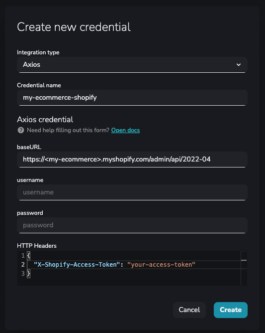
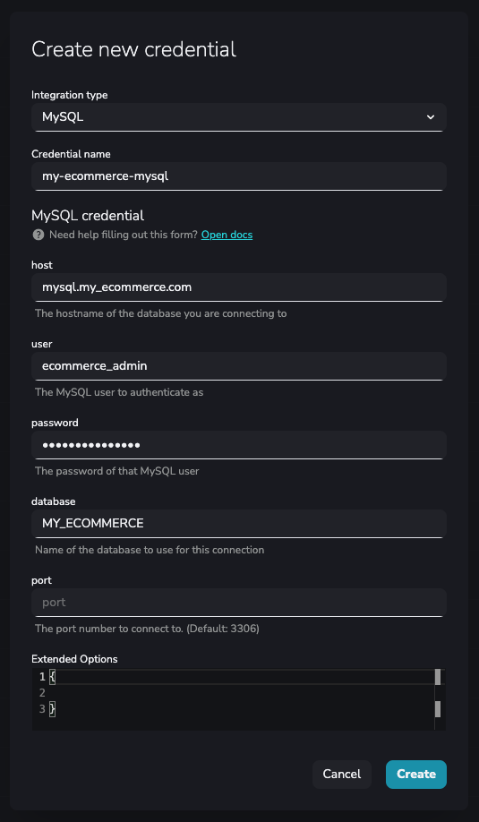

Today, we are going to see how to copy your [**Shopify**](https://www.shopify.com/) e-commerce orders data into a database. It will be [**MySQL**](https://www.mysql.com/) for this case.

You probably are receiving many orders per day, so this copy process should be executed periodically to keep the database updated. For this reason, to be efficient, the process should load only the orders created since the last copy.

We are going to implement this copy process in a few minutes using YepCode and some of its features:

-   We'll start using a recipe from our [**recipes page**](https://yepcode.io/recipes). This will provide us with a code base that can be working with only a few changes. For this case, we'll use the [**Shopify orders to MySQL**](https://yepcode.io/recipes/shopify-orders-to-mysql) recipe.
-   To perform an incremental copy, we need to store the last copy date somewhere. We could use a control table in our database. However, we can do it in a more efficient way using [**YepCode datastore**](https://docs.yepcode.io/datastore) for this purpose. This datastore allows you to CRUD key-value pairs in each execution of the copy process.

### Starting from the recipe

First, we'll create a new process using the [**Shopify orders to MySQL**](https://yepcode.io/recipes/shopify-orders-to-mysql) recipe. To do this, from the recipe page, click on **Clone to YepCode** button and then select your YepCode team. Click on **Create** and you'll be redirected to the process page.In the process page you can see recipe source code. Looking along it you can see four blocks of comments, each one containing a **TODO** statement. Let's review all of them! From top to bottom:

##### TODO: Create your Axios credential with Shopify information

You'll need to create a credential to be able to connect to Shopify API. So this TODO aims to create one.

As the comment says, you need to provide your [**Shopify access token**](https://help.plytix.com/en/getting-api-credentials-from-your-shopify-store) by headers to be able to make requests to their API.

You can create the credentials from the right sidebar, by clicking on the add button in the credentials section. Then select the Axios credential and fill in the needed info.

Here you have an example of Shopify credential creation:



Once you have created it, replace the credential name in the source code, just under this block of comments. For this example, you should replace _"your-shopify-credential-name"_ by _"my-ecommerce-shopify"._

##### TODO: Customize your request, checking the API documentation

You may want to customize your request to fetch only the orders you need. For now, you don't need to change anything here. This request will fetch all the orders. We are going to come here later.

##### TODO: Create your MySQL credential

The same as for Shopify, you need a MySQL credential to be able to connect to your MySQL.Here you can see one example with the needed parameters for the MySQL credential.



As in the previous case, replace the credential name in the process source code. For this example, replace "_your-mysql-credential-name"_ by _"my-ecommerce-mysql"_.

##### TODO: Map your item to row and customize INSERT statement

You need to modify the insert statement with your table name and store the desired item properties in your query.

An example of the change in the code would be:

```js
async consume(item) {
    return await this.mysql
        .promise()
        .query(`INSERT INTO my_ecommerce_orders SET ?`, {
            id: item.id,
            currencyCode: item.currency_code,
            email: item.email,
            financialStatus: item.financial_status,
            orderNumber: item.order_number,
            processedAt: item.processed_at,
            totalPrice: item.total_price
        });
}
```

Now, after these changes, you'll be able to copy all of your orders data to our MySQL database each time the process is executed.

However, as we said, there will be new orders each day, and we don't want to re-copy all orders each time we want to insert the new ones.

For this reason, we'll turn this process into an incremental copy process, which copies only the orders generated since the last process execution date.

#### Make the process incremental

To fit this requirement, you need to store the copy's execution time and retrieve it in the next execution to fetch only the orders after that moment.

You could use an auxiliary control table in your database, but YepCode offers a more agile way to reach this. This is using the data store. As we said, it allows to CRUD key-value pairs in each execution of the copy process.

So, in each execution, we'll retrieve the stored date of the previous execution, keep it in a variable and then update the same entry with the current date. Translating it to code, it looks like the code below, which you can paste at the beginning of your process source code:

```js
const { DateTime } = require("luxon");

const LAST_EXECUTION_DATE_KEY = "shopify_to_mysql_copy_last_execution";

const lastExecutionDateAsISO = await yepcode.datastore.get(LAST_EXECUTION_DATE_KEY);

// Update the datastore entry with current execution date
yepcode.datastore.set(LAST_EXECUTION_DATE_KEY, DateTime.now().toISO());
```

This is the moment when we come back to the second TODO, where it was not required to do changes before.

Now, you need to customize the Shopify API request to fetch only the orders created after the last execution date. For this, you need to add the "created\_at\_max" query parameter, and set its value with the variable created in the previous step. The resulting code would be:

```js
const {
    data: {
        orders
    },
} = await this.axiosClient.get(`orders.json?status=any&created_at_max=`${lastExecutionDateAsISO});
```

And that's all, now you have configured an incremental copy process!!

You can run it manually, schedule it or execute it via webhooks! Each time the process is executed it will only copy the orders generated after the last execution!

##### Next steps

You have an incremental copy process, which was implemented in a few minutes!If needed, you could continue iterating this process to fit more needs. For example, you could send an email, telegram message, etc. with some info about the process each time it is executed. For this case, that info could be the total order price sum of the copied orders. We've done this for Shopify orders to MySQL, but this can be done for any of the services and APIs you can find in our [**recipes page**](https://yepcode.io/recipes)! You can browse there and find if there are more recipes which fit one need you have.

Thank you for reading :) and...

Happy coding!
