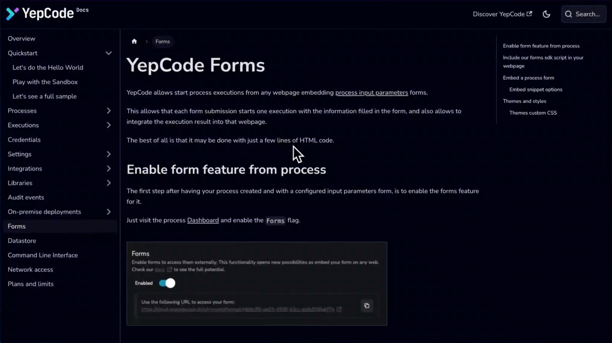
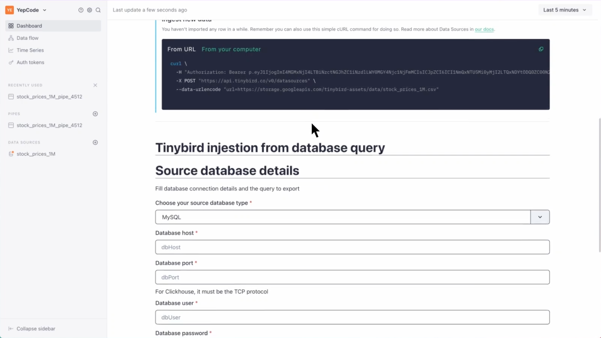
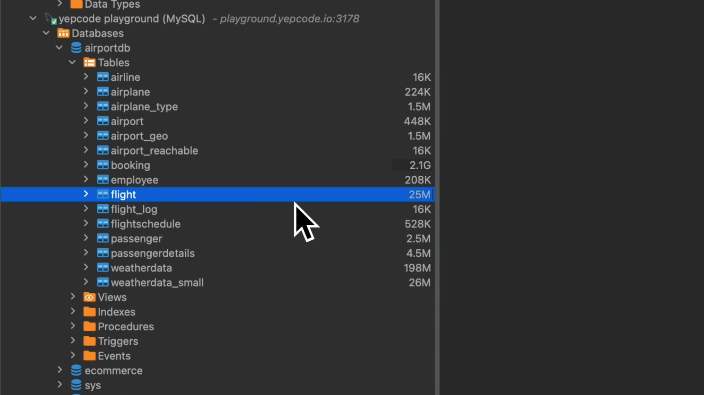
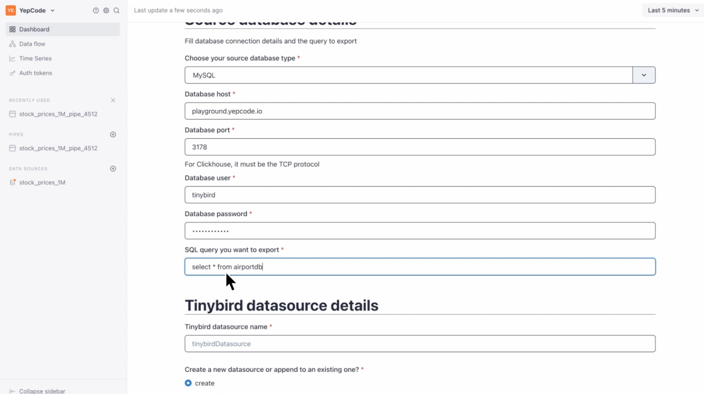

In this post, we'll be discussing one of the latest and most interesting features of YepCode - YepCode Forms.

As you know, YepCode is a platform that allows users to perform **integrations and automations between an infinite number of services** in a simple way. But what sets YepCode apart is its ability to [**extend the functionalities of other SaaS products**](https://yepcode.io/blog/docuten-extended-saas-features-using-yepcode), which is where the YepCode Forms feature comes in handy.

[**YepCode Forms**](https://yepcode.io/docs/forms/) is a mechanism that allows the **input form of a YepCode process to be embedded in any type of application or webpage**. By using the YepCode SDK published in JavaScript, you can embed 'divs' with your team's name, process name, callback functions, and error handling to enable the use of YepCode Forms in your application.

Once embedded, you can trigger an execution of the YepCode process that includes all the code you need to go to a database, retrieve information, perform REST or GraphQL invocations, or any other action you're interested in.

### **YepCode forms in Tinybird**

We are going to explore now a specific case of using YepCode Forms with [**Tinybird**](https://www.tinybird.co/), a popular serverless database platform. We will see how a new information ingest system can be incorporated into Tinybird **without modifying the core of its product**.

On the **home page** of the Tinybird dashboard, **we have embedded a YepCode form** that allows users to choose a type of database, such as MySQL, PostgreSQL, or ClickHouse. The form asks users for a host, port, username, and password.

Users must indicate which query they want to execute against this database (in this example, MySQL) to export the results and take them to Tinybird.

For instance, if you select the 'flight' table from 'airportDB', you can put a select query and give the name to the DataSource in Tinybird.

When **submitted, this triggers the execution of the YepCode process**, which imports the data **very fast** thanks to the fact that Tinybird imports the data very quickly, and the [**YepCode process uses a streaming approach**](https://yepcode.io/blog/nodejs-stream-system-to-move-data-and-save-memory-consumption), without loading the data in memory. This means that **the import process is very agile** and can handle large amounts of data seamlessly.

Overall, YepCode Forms is a powerful feature that can help users extend the functionalities of other SaaS products. With its ease of use and flexibility, it's no wonder why **YepCode Forms is quickly becoming a favorite among developers** and users alike.

In the next **video**, you can **see the full-detailed process** and see how YepCode Forms can help you achieve your integration and automation goals.

Enjoy it and...

Happy coding! 🧑‍💻
