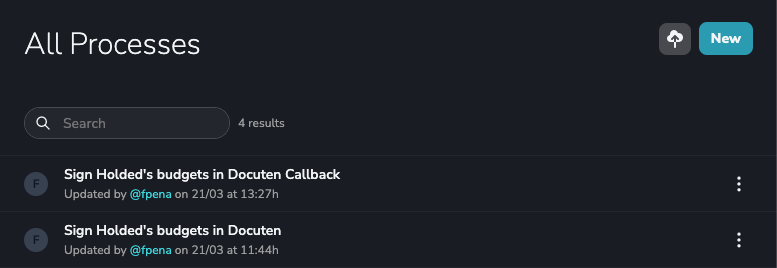
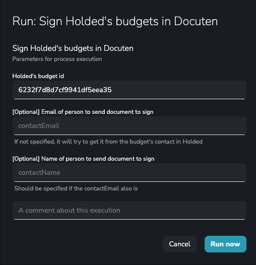
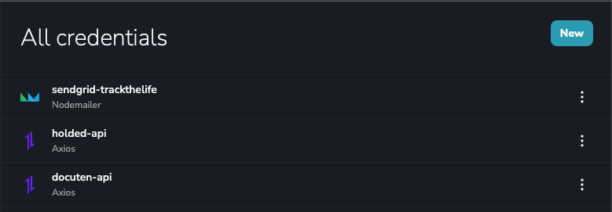
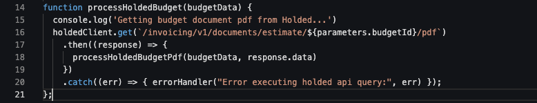
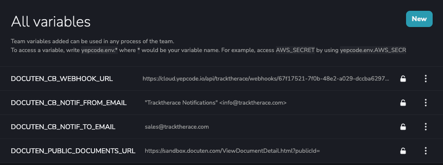

In this case, we will proceed to **automate an estimate document signature** using Holded as a platform for generating, downloading and storing that document. This time we will use **Docuten** as an **electronic signature tool**, but we have also implemented this use case using **DocuSign**.

Holded is a [**cloud business management platform**](https://www.holded.com/) that allows you to carry out administrative procedures. With Holded you can have all your **data**, such as **documents**, **invoices**, and **customer information centrally** **controlled.** You can also associate this data with specific projects and share them among members of the same team.

This tool, also allows you to control the **management of your billing**, **accounting**, work teams, and **projects.** And it has **CRM features**.

Additionally, Holded **integrates with other third-party tools** thanks to its API. This makes its functionalities even more extensive and allows it to **automate processes** involving other complementary applications.

### **What is the workflow to automate Holded documents signature?**

Imagine this situation: One company sends another a quote for hiring their services.

The **workflow** begins when the sales department prepares and generates a **document of this quote in Holded**. From there, they send it to the client for review and acceptance.

When the **client accepts the quote**, the sales department has to notify the administration department to **download** the estimate document **from Holded.** Then, they **upload it to their eSign provider** (in this case we'll use [**Docuten**](https://docuten.com/)). And from that tool, they send it to the client for **final signature**.

Once signed, the eSign provider sends a notice to the **administration department**. When this is done, they will have to **download the signed document** and send it to the sales department. In the final step, the sales department will have to upload it again to Holded to file it and **assign it to the corresponding project**.

This is a process that would take **considerable time.** It has **many** **bottlenecks** where delays can occur as it is very easy to miss the notices between sales and administration.

> With this process, we solve just in minutes what before would take us days.- Felipe Peña (Tracktherace CFO)

### **How do I proceed in YepCode to implement this process?**

In order to automate Holded documents signature in **YepCode,** **we have to define two processes.** One to **launch the signature** request and another to **handle the eSign provider callbacks** once the client has signed the quote.

To launch a new signature request, we will simply execute the first process. We will **enter the quote Id in Holded as a parameter** and optionally we will **indicate the email and name of the person responsible** for signing (in another case, the data of the person responsible for the client associated with the quote in Holded).

We will launch the second process [**thanks to the** "**webhooks**" **functionality**](https://docs.yepcode.io/executions/webhooks) provided by YepCode and **the Docuten service will automatically invoke it** when the client has signed the quote.

In order to implement the processes, we have defined three "**credentials**". For two of them, we will use the **integration with Axios** for access to the **Docuten and Holded APIs** (where we configure our access token to them). In the third, we will use the **integration with Nodemailer** (with our access data to **SendGrid** that we will use to send notifications by email from the processes).

Some code usage examples of these integrations:

Finally, we will also make use of the **variables function** to **parameterize the processes.** By doing this, they can be **imported and other clients could use them** according to their own needs.

And that's all. We have reduced a considerable amount of time by creating this process (around 75% of the time), since with a few clicks we can solve the electronic signature of an estimate.

This demonstrates YepCode's ability to [**connect with other platforms and create automations**](https://yepcode.io/using-yepcode/docuten-extended-saas-features-using-yepcode/) to speed up day-to-day tasks.

Remember to visit our [**Docs platform**](https://docs.yepcode.io/) where you can find every single detail to make the most out of YepCode,

Happy coding! 🧑‍💻
