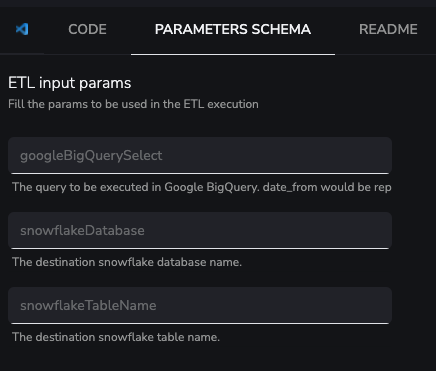

Following the topic line of articles in which we explained in detail some practical examples of [**how to carry out different processes, automation and integrations with YepCode**](https://yepcode.io/blog/), today we are going to talk about how to automate the transfer of large volumes of data from **Google BigQuery to Snowflake** in the most efficient way.

### Moving large amounts of data from Google BigQuery to Snowflake is not an agile duty

There are lots of **NoCode ETL tools** in the market that **allow moving information between several data sources** (both on-premise services or SaaS). But it's a common problem that users can't fully adapt those loading processes to all their needs.

Think, for example, in a scenario where information is generated every day in [**Google BigQuery**](https://docs.yepcode.io/integrations/google-bigquery) (ie: Google Analytics events information). Imagine that you want to **copy that information into a** [**Snowflake**](https://docs.yepcode.io/integrations/snowflake/) **database in a nightly process**.

A mandatory requirement should be to copy only new events that have not been previously copied. Before going to BigQuery, you need to go to **Snowflake to retrieve the last loaded date**. This way you can use it later **to build the BigQuery SQL sentence**. Typically, this may be to **check the max value of a date** column or use a control table that **tracks every load execution**.

You may also need to be notified (with an [**email**](https://docs.yepcode.io/integrations/nodemailer/) or a [**Slack**](https://docs.yepcode.io/integrations/slack-bolt/) notification) about **how that load was performed** (ie: reporting the number of new events loaded).

One last requirement could be take to into account that **millions of events are generated every day**. In that case, a _simple_ approach of **running an SQL against BigQuery and for each row performing an insert in Snowflake may not work.**‍

```js
// This is a bad approach to load millions of rows

const [job] = await bigqueryClient.createQueryJob({
    query: `SELECT column1, column2 FROM table1`
});
const [rows] = await job.getQueryResults();

snowflakeClient.execute({
    sqlText: 'insert into table1(column1, column2) values(?, ?, ?)',
    binds: rows.map((row)=> [row.column1, row.column2]])
}); 
```

### We leverage Yepcode integrations to create the most effective workflow for this process

Under this situation, the flow we would propose using YepCode integrations would include these steps:

-   Run a **synchronous SQL** **select against Snowflake** to get the last loaded date and also the current amount of events. We could **use a reusable function for this syncExec approach** and **include it in one** [**YepCode JS Module**](https://docs.yepcode.io/processes/js-modules):

```js
exports.snowflakeSyncExec = (snowflakeClient, sqlText, binds = [], rest = {}) => {
  return new Promise((resolve, reject) => {
    snowflakeClient.execute({
      sqlText,
      binds,
      ...rest,
      complete: (err, stmt, rows) => {
        if (err) {
          reject(err);
          return;
        }
        resolve([stmt, rows]);
      },
    });
  });
}
```

-   With that **reusable function**, the last loaded **date** and current amount of **rows** could be **retrieved** with something like:

```js
const [, rows] = await snowflakeSyncExec(snowflakeClient, "SELECT MAX(DATE) AS LAST_LOADED_DATE, COUNT(1) AS ROWS_AMOUNT FROM table1");

const LAST_LOADED_DATE = rows[0].LAST_LOADED_DATE
const ROWS_AMOUNT = rows[0].ROWS_AMOUNT
```

-   Using the previously retrieved date, we could **create a Google BigQuery SQL sentence** to get the new events and **execute** that query **in BigQuery**.
-   Instead of returning the rows, we'll **leave them in a** [**Google Cloud Bucket**](https://docs.yepcode.io/integrations/google-storage/) **with CSV format**.
-   To achieve this, we must **use the export data feature**, which may **leave the rows returned by the query in a CSV** file within Google Cloud Bucket [(](https://cloud.google.com/bigquery/docs/exporting-data)[related docs)](https://cloud.google.com/bigquery/docs/exporting-data).
-   A piece of sample code could be:

```js
const exportQuery =
  `EXPORT DATA OPTIONS(
  uri='gs://my-google-cloud-bucket-name/my-table-export-file_*',
  format='CSV',
  header=true,
  compression='GZIP',
  field_delimiter=',') AS
  SELECT column1, column2 FROM table1 WHERE date > @last_loaded_date
  `;

googleBigQueryClient.createQueryJob({
  query: exportQuery,
  params: {last_loaded_date: LAST_LOADED_DATE}
});
```

-   Note that this **data export** approach may be **also used with GZIP compression** to reduce network use.
-   Having the query result exported in a file in the bucket, we can directly **load that CSV file into Snowflake** **using** a preconfigured stage. This is a **lovely feature** in Snowflake ([related docs](https://docs.snowflake.com/en/user-guide/data-load-gcs-copy.html)).
-   The piece of code could be:

```js
const importCSVSqlSentence =
  `COPY INTO my_table_name
  FROM @stage_for_google_cloud_bucket
  PATTERN='my-table-export-file_.*';`;

snowflakeSyncExec(snowflakeClient, importCSVSqlSentence);
```

-   Having the new information loaded in Snowflake, we could **remove the previously generaded CSV files**. The [**Google Cloud Storage**](https://docs.yepcode.io/integrations/google-storage/) integration may help us:

```js
googleCloudStorageClient.bucket('my-google-cloud-bucket-name').deleteFiles({
    prefix: 'my-table-export-file_'
});
```

-   As last step we could **run another query in Snowflake** to get the new number of events loaded and with that information, we could **build a notification message** and deliver it via email or with the slack integration [(related docs)](https://slack.dev/bolt-js/concepts#message-sending).
-   The piece of code to send that message could be:

```js
await slackBotClient.chat.postMessage({
  channel: "bigQuery-snowflake-load",
  text: `Load successfully finished with ${rowsAmount} new rows copied!`,
});
```

To implement the full process in YepCode, you'll need to **configure a Google service account** with access to the **Google BigQuery** and **Google Cloud Bucket**. Also, follow the guide in Snowflake to configure a stage that may be able to read information from that Bucket.Having that configuration created, the best option could be to **create a generic process** that could **carry out the movement of information** in a parameterized way, receiving these parameters:

-   SQL sentence to execute in Google BigQuery (having the start load date as a parameter)
-   SQL sentence to execute in Snowflake to retrieve the last loaded date and the number of events
-   Snowflake destination database and table name


