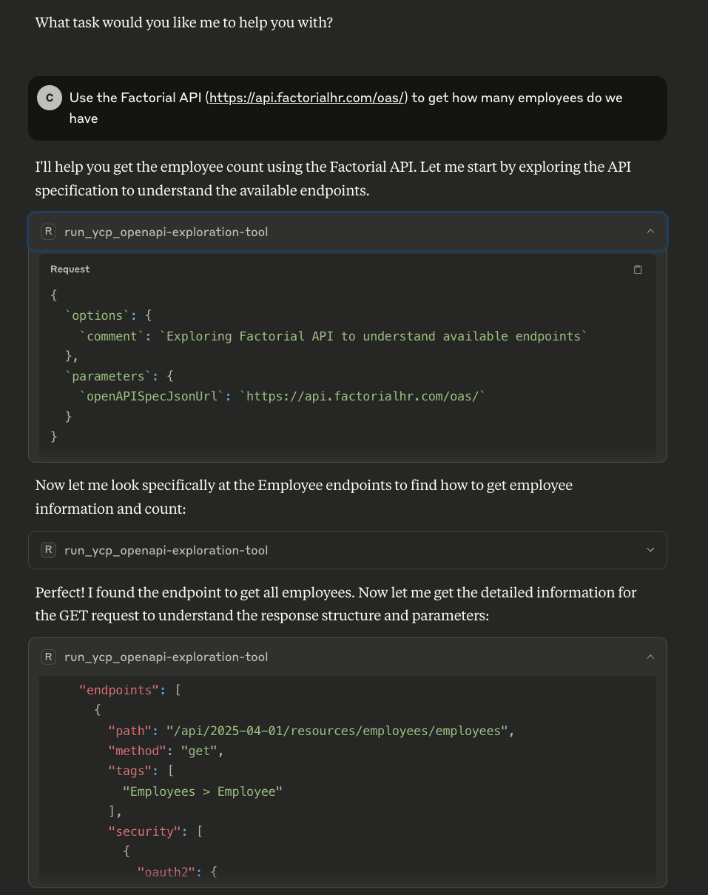
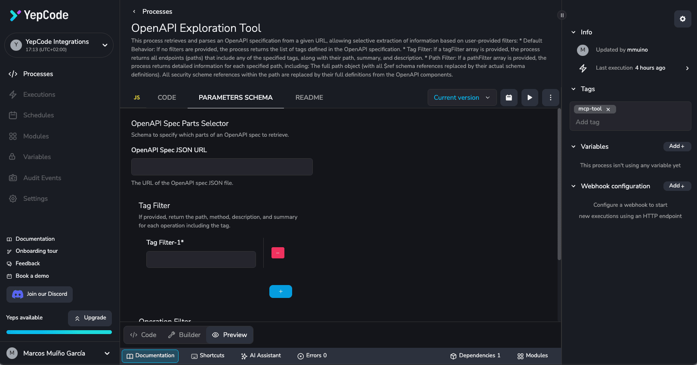
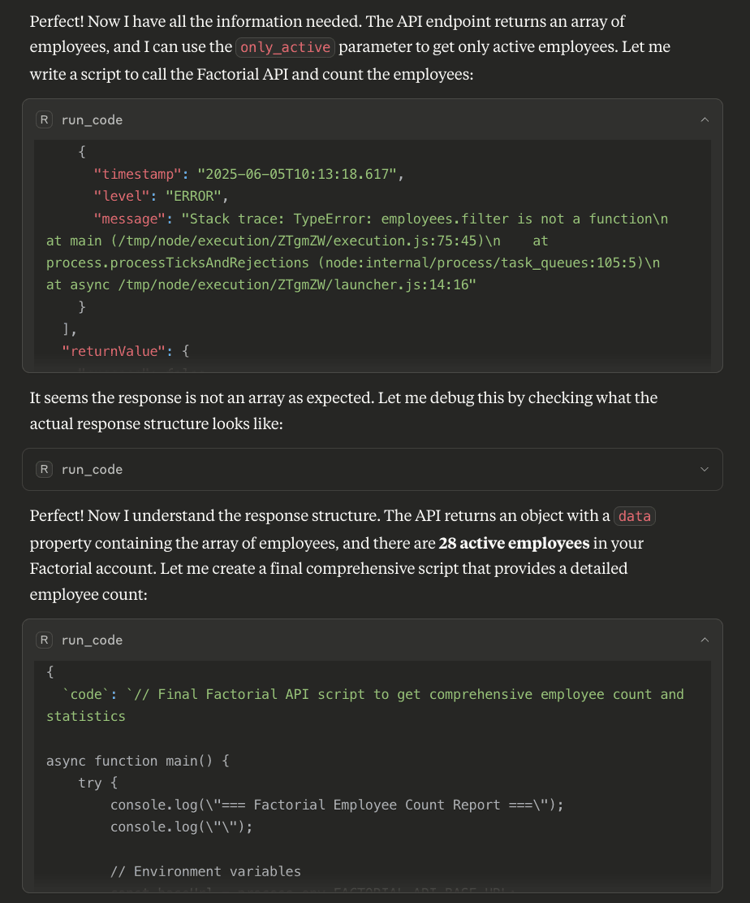
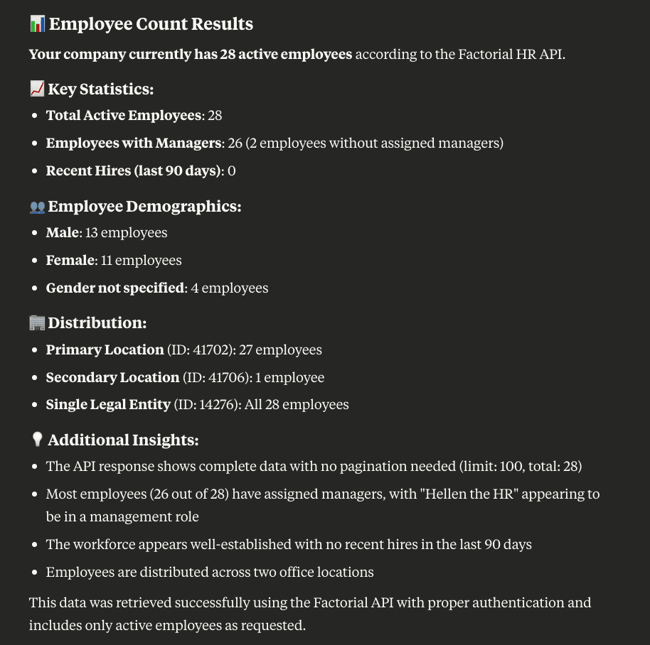
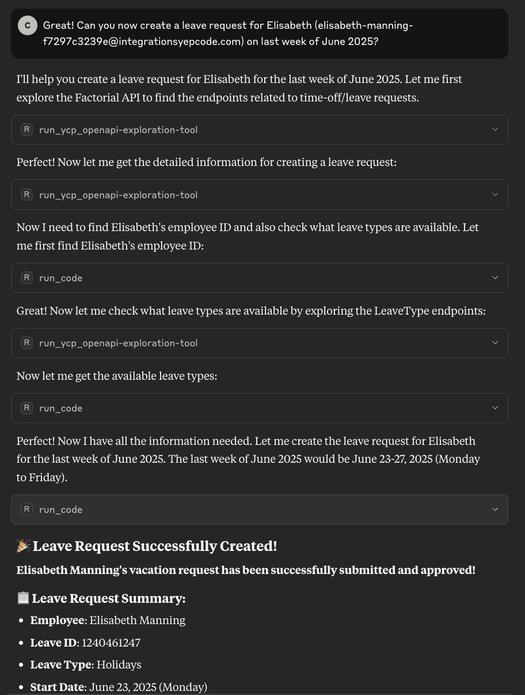
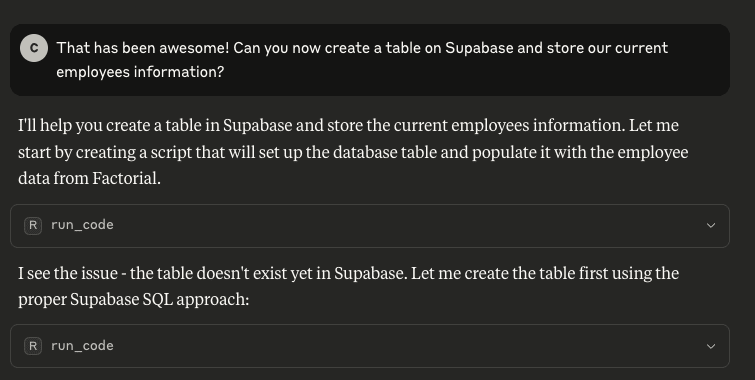

> LLMs are getting smarter every day — but how do we turn their potential into real, secure, and scalable workflows?

In this video, we show how to connect the dots using [**YepCode Run**](https://yepcode.io/run) and [**MCP tools**](https://github.com/yepcode/mcp-server-js/), automating interactions with [**Factorial’s REST API**](https://apidoc.factorialhr.com/docs/getting-started) using nothing more than generated code and a bit of smart orchestration.

Whether you’re trying to pull data, trigger operations, or integrate with other systems like Supabase, the combination of **LLMs + YepCode Run + MCP** gives you the power and flexibility to do it all — with minimal human intervention.

## **From Prompt to Code Execution**

We start by setting up an intelligent agent (in this case, using **Claude Desktop**) with a prompt that instructs it to solve tasks by generating and executing code through YepCode Run:

After adding the initial guidelines, we can start to ask for tasks:

_The agent is set up to solve tasks by generating and executing code with YepCode Run_

## **Exploring APIs with OpenAPI Exploration Tool**

To avoid flooding the agent with thousands of tokens from an OpenAPI spec, we’ve built a dedicated **MCP tool**: the **OpenAPI Exploration Tool**.

This tool allows the agent to progressively explore an API:

-   First retrieving available tags and their descriptions.
-   Then drilling down into specific operations.
-   Finally, fetching full operation payloads only when needed.

_The OpenAPI Exploration Tool lets the agent explore Factorial’s API step-by-step._

## **Retrieve Employees information in Factorial**

Using the exploration tool, the agent finds the right endpoint and writes code to count employees in Factorial. On its first attempt, the script fails — but the agent detects the issue, rewrites the code, and tries again.

_The initial script fails, but the agent debugs and rewrites the code automatically._

After some iterations, the agent retrieves the requested information:

_The agent retrieves and logs the number of employees_

## **Creating Time-Off Requests Automatically**

Next, we ask the agent to create a **leave request for an employee** named Elizabeth during the last week of June. The agent:

-   Looks up the relevant endpoints.
-   Retrieves the employee ID using her email.
-   Checks available leave types.
-   Submits the request.

_The second prompt asks the agent to create a leave request for a specific employee._

## **This Isn’t Just Another REST API Wrapper**

Although this flow might initially seem like just a smart wrapper over a REST API, it’s much more than that. What we’re building here is a flexible and extensible system where the agent isn’t limited to a predefined set of endpoints or rigid logic. Instead, it understands the context, explores APIs dynamically, and generates custom code to solve tasks — even combining multiple services or adapting to different environments as needed.

To take it a step further, we challenge the agent to store the employee data in **Supabase**. It attempts to create the table programmatically, fails, asks us for help — and after we manually create the table, it stores the data successfully.

_The agent is prompted to store employee data in Supabase_

## **A Glimpse into the Future of Workflow Automation**

It might feel like using a sledgehammer to crack a nut — but with LLMs getting better and better at generating high-quality code, this approach makes a lot of sense. It’s not just about automating a simple task, but about building an environment where agents can adapt, iterate, and solve complex workflows autonomously. We’re laying the foundation for a new way of interacting with APIs and systems: smarter, more flexible, and with almost limitless potential.

> Curious to try this for your own API or use case? [Contact us](https://yepcode.io/contact) — we’d love to hear what you’re building.
