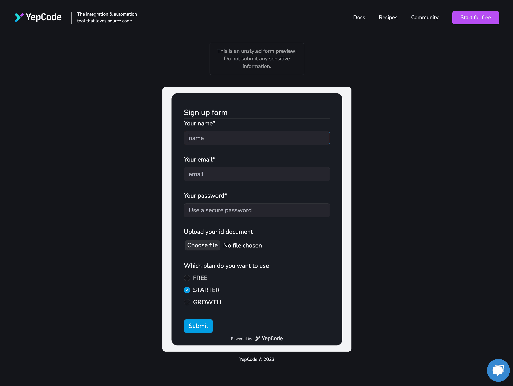

import YouTube from "../../components/YouTube.astro";

For those of you who already know YepCode there is little to say, but for those who don't, we invite you to discover this incredible automation platform that can revolutionize the way you work. And that's not all: YepCode has just launched a [**new feature called YepCode Forms**](https://yepcode.io/docs/forms), which we are happy to share with you.

In this blog post, we'll explore **how YepCode Forms work** and how they can help you **create custom forms that trigger YepCode process executions**. So, grab a drink, settle in and get ready to discover how YepCode Forms can take your workflow to the next level!

Getting started with YepCode forms is super easy. To begin, head over to the **YepCode documentation page, where you'll find detailed information** on how these forms work and how to configure them. With YepCode Forms, you can easily trigger any type of YepCode process by asking users for input parameters. And the best part? You can **embed these forms in any external website**.

In the following **video, we are going to see an example of creating a form** to allow users to register for a webinar. To do this, we need to create a new YepCode process, configure the parameters and enable the form. We then copy the code and embed it in our website using an embed element. Once the form is rendered, we can customize it to suit our needs.

<YouTube url="https://www.youtube.com/embed/ZA6XIkKMKXo" title="Empower your web pages with YepCode Forms | Full configuration tutorial" />

With YepCode Forms, customizing your form has never been easier! You have full control to modify the title, input fields, and attributes to fit your specific needs. Plus, once a user submits the form, you can trigger process execution and collect input parameters to send personalized messages back to the user.

But that's not all. Here is a **list of some amazing things you can get with our forms**:

-   Integrations with (ie: [HubSpot](https://www.hubspot.com/)) to create new users and send emails or [Slack](https://slack.com/) messages
-   Multiple configuration options, including **embedding with function or div code**, using a **React component** and customizing form behavior with **callback functions** and **error handling**
-   Default behaviors like **redirecting to a URL** or executing a **JavaScript callback**
-   **Style customization options** such as setting default parameters, customizing with **CSS variables** and changing the text on the submit button to match branding

What's more. You can go further and create some seriously awesome forms, even if they're complex ones with requests for **attributes or file uploads**.

And the best part? It is easy to embed the whole process right into any web page you want and create custom forms that trigger those executions.

If you're looking to **streamline your business processes**, you have to check out YepCode Forms.

Thanks for reading and happy coding!
