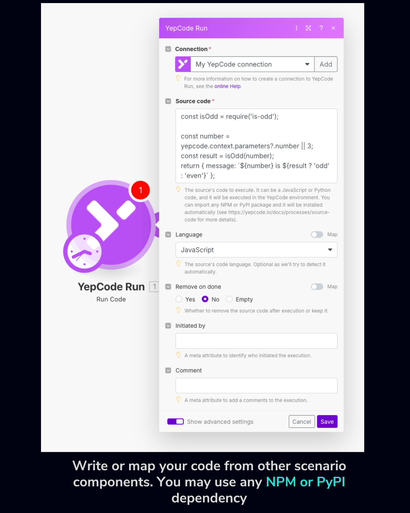
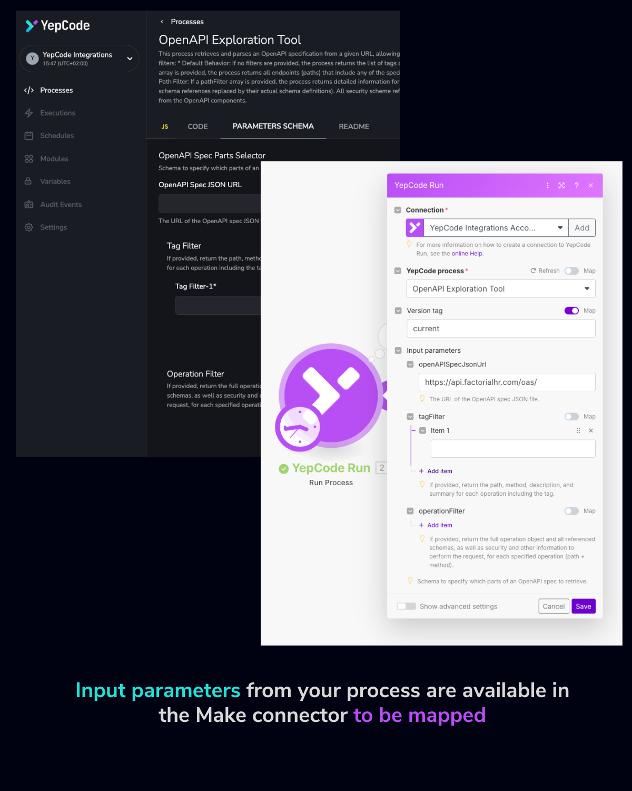

🤝 _NoCode and YepCode?_ Turns out they can play nicely together — and when things get complex, they make a _great_ team.

We’re thrilled to announce that **YepCode is now available as an official connector in** [**Make**](https://www.make.com) (formerly Integromat)! 🎉

This integration brings the full power of **custom serverless code execution** right into your no-code scenarios — unlocking a whole new level of flexibility for creators, developers, and automation pros.

## **🚀 Why We Built It**

At YepCode, we’re all about connecting services, APIs, and databases through code — quickly, securely, and without managing infrastructure. But we also know that **no-code platforms like Make are fantastic for building fast, visual automations**.

Still, there’s a limit to what can be done without code. And that’s exactly where YepCode comes in.

When your Make scenario needs to:

-   Call a less-common API that doesn’t have a native Make module
-   Transform complex data structures
-   Or let an AI agent generate and execute custom logic…

**YepCode is now just a connector away.**

## **✨ What You Can Do**

The new **YepCode Run** connector enables you to:

✅ **Execute any custom serverless function directly from Make**, by mapping your YepCode function inputs right inside the scenario

✅ **Use LLM-generated or prebuilt code** to connect to services, APIs, or databases — including **any PyPI or NPM package** (we handle all the dependencies)

✅ **Supercharge your no-code flows** with the flexibility of code — without setting up servers or managing deployments

## **🤖 Make AI Agents + YepCode = Endless Possibilities**

Our new connector is a perfect companion for Make’s powerful AI Agents. Let’s say your agent is smart enough to generate the right code to solve a task — but has no way to run it. That’s where YepCode comes in. ⚡

By plugging YepCode into the flow, you give your agents a secure, scalable, and flexible execution environment. It’s not just about suggesting a script — it’s about getting the job done.

This approach it's perfect to be used as **fallback tool** when your current scenarios doesn't fit.

## **🧪 Want to Try It? Let’s Build Together**

👉 **Give it a spin** inside Make — just search for “YepCode Run” in the scenario builder.

Got a complex use case or idea you’d love to prototype?

We’re happy to **collaborate on automation POCs (proofs of concept)** — just tell us what you have in mind!

## **🔗 Ready to Connect?**

You can explore more about YepCode at [yepcode.io](https://www.yepcode.io), or jump straight into [Make.com](https://www.make.com) to start using the connector.

Let’s see what happens when no-code and full-code join forces.

Because automation should have **no limits**.
