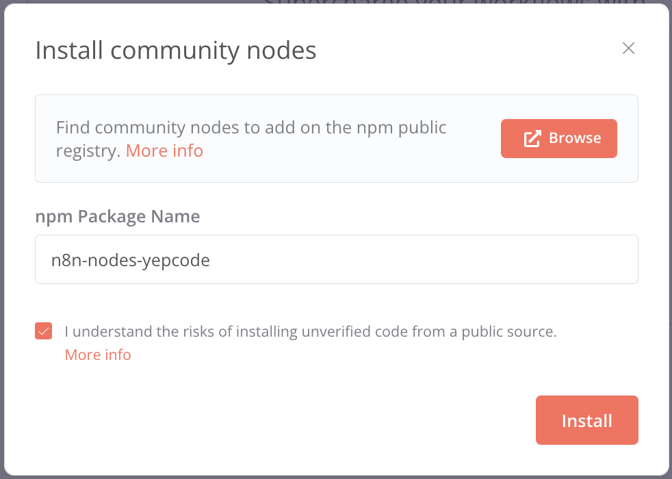
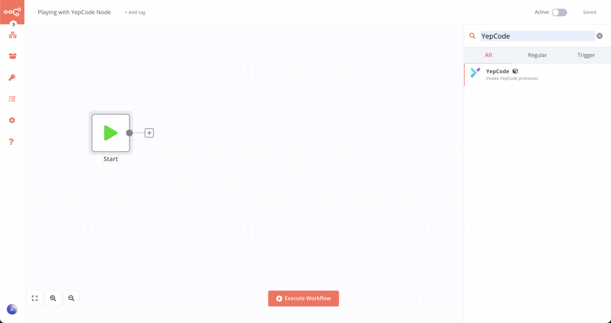
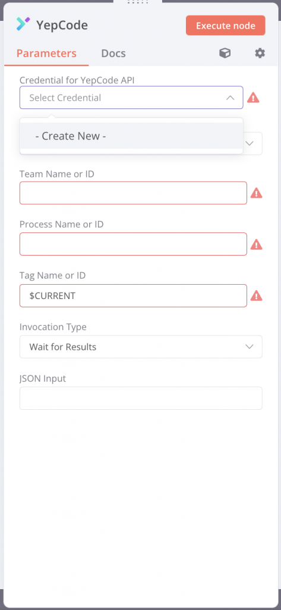
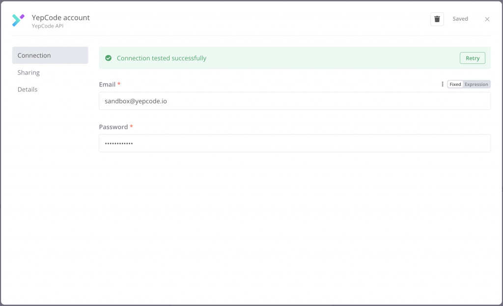
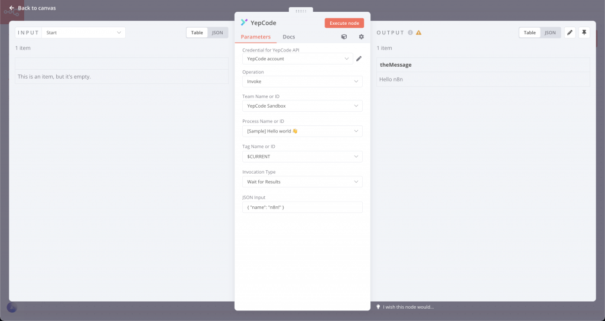

**n8n** is a [**great no-code workflow automation tool**](https://n8n.io/). It is very useful when you want to build multi-step workflows combining 3rd party APIs and your own internal tools. In addition, it is also self-hosted and open source as it follows a [**fair-code**](https://faircode.io/) distribution model.

But sometimes, when your workflow starts growing wildly, using many nodes and becoming increasingly complex, it can be difficult to maintain.

YepCode is also an automation tool, but it follows a different approach: **It is a full-code platform.**

This gives it a lot of power, as it makes it the perfect tool to **deal with more complex tasks**. For this particular case, it would help you to reduce the number of n8n nodes.

YepCode also gives you some additional features: [**process versioning**](https://docs.yepcode.io/processes/process-versioning), monitoring through [**audit events**](https://docs.yepcode.io/audit-events), a permanent [**datastore**](https://docs.yepcode.io/datastore), and much more...

In some use cases, it may be interesting to **start an automation problem with n8n but rely on YepCode for some steps.**

Some examples might be **implementing complex logic, moving a large amount of data, or using streaming for some task.**

You can leverage some n8n triggers and then start some YepCode process to run that logic, and after you're done, the n8n flow could be kept.

So... how do I connect my YepCode with n8n? Firstly, you'll need:

1.  An n8n installation or [n8n cloud account](https://n8n.io/get-started/)
2.  A [YepCode account](https://yepcode.io/)

Let's get started!

### Installing YepCode community node

n8n includes a lot of built-in integrations, and also supports extensions using [**community nodes**](https://docs.n8n.io/integrations/community-nodes/). This is the approach we have followed to include YepCode support. YepCode community node is called _n8n-nodes-yepcode_, you can find it on npm [here](https://www.npmjs.com/package/n8n-nodes-yepcode).

-   Open your n8n
-   Click on **_Settings > Community nodes_**
-   Enter _n8n-nodes-yepcode_ as **npm package name**
-   Agree the risks
-   Click on **Install**

There you go, now we can add YepCode nodes into our workflow.Let's do a dummy sample.

### Adding a YepCode node in n8n

Create a new workflow just for testing, click the plus button to add a new node. Type "_yepcode"_ on the search filter and click on YepCode node.

Excellent, n8n prompts the node configuration that we need to fill.

Let's explain each field:

-   **Credential for YepCode API**. If you don't have one, click on - Create New - then fill **Email** and **Password** with your [YepCode account](https://yepcode.io/)

-   **Team Name or ID:** Shows all YepCode teams you belong to.
-   **Process Name or ID:** Shows all processes related to the team you have selected. Tip: Only processes with enabled webhook are available. Check [here](https://docs.yepcode.io/executions/webhooks) how to enable webhooks in your process.
-   **Tag Name or ID:** Here you select the version tag or the current code of your process to execute. You can read more about YepCode versioning [here](https://docs.yepcode.io/processes/process-versioning).
-   **Invokation type:** Select if you want to wait for the YepCode execution to finish or continue your flow right away.
-   **JSON input:** This is the JSON that your YepCode process is going to receive, for more info check [webhook docs](https://docs.yepcode.io/executions/webhooks#invoking-webhooks-externally).

That's it, now you are ready to execute your YepCode node! Connect it in your workflow with other nodes and feel the power of YepCode and n8n combined!

Thank you for reading :) and...

Happy coding!
