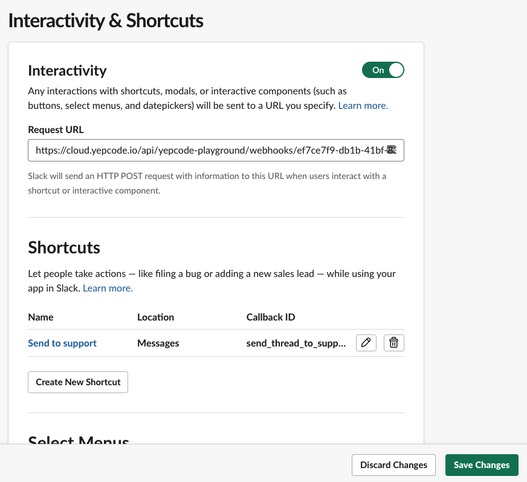
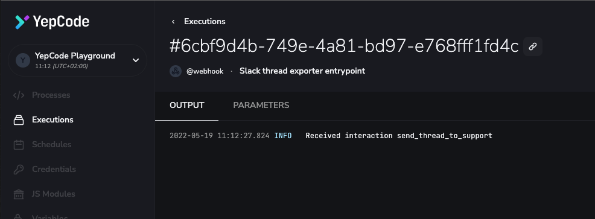

[**Slack is widely used in customer support teams**](https://slack.com/intl/es-es/), as its integrations with CRMs make this messaging tool the perfect way to be aware of several conversations or tickets.

Sometimes, it may be necessary to **export the information generated** there to share it with other teams (ie: technical support). In this post we'll show you how YepCode may help in this task, **creating a process that delivers by email the content of a slack thread.** To run this example we are going to need a YepCode account (it's free!) and to be a Slack admin of one workspace.

### Creating the YepCode process

-   Open your [team workspace](https://cloud.yepcode.io/) in YepCode
-   Click on **_New_** button in the processes page
-   Choose a name and a description


You will be redirected to the process page. Don't worry about the code of the process, we are going to deal with that later.

Now we are just going to **configure a webhook** on this process so Slack can communicate with it.

-   Click on **_Add+_** button in the right sidebar, next to _Webhook configuration_
-   Don't fill basic auth options, we need this webhook to be public
-   Click on **_Create_**!

Perfect! A modal will prompt you with webhook info: the important thing is the **URL link.** We will need it later to configure our Slack Shortcut! You always can come back to the _Webhook configuration_ to copy the **URL link**.

### Creating the Slack App

To create your own Slack App open your [app's dashboard](https://api.slack.com/apps) and click on **_Create New App_** button. You only need to choose a name and a workspace.


Excellent, we have a brand new Slack App!

We are going to use [Slack Shortcuts](https://api.slack.com/interactivity/shortcuts) instead of [Slack Commands](https://slack.com/help/articles/201259356-Slash-commands-in-Slack). Why? The reason is that you can't use commands inside a thread, instead, [message shortcuts](https://api.slack.com/interactivity/shortcuts/using#message_shortcuts) are options that are shown in any message context menu.

### So... how do I create my Slack Shortcut?

-   Open your [app's dashboard](https://api.slack.com/apps)
-   Click on _Interactivity & Shortcuts_ in the sidebar
-   Enable _Interactivity_: It will ask you for a **Request URL**, paste here our webhook **URL link** from our YepCode process.
-   Click the **_Create New Shortcut_** button under _Shortcuts_
-   Choose On Messages option and click **_Next_**
-   Fill in a name, a short description and a callback ID.
-   Click that tempting green **_Create_** button, and you'll be sent back to the _Interactivity & Shortcuts_ page
-   On that page don't forget to click the **_Save Changes_** button!



Now we need to configure an access token to communicate Slack and YepCode and add some permissions to the bot

##### Configure OAuth and Permissions

-   Open your [app's dashboard](https://api.slack.com/apps)
-   Click on _OAuth & Permissions_ in the sidebar
-   Click on **_Install on workspace_** button under _OAuth Tokens for Your Workspace_
-   Click on **_Allow_** button so Slack to confirm
-   You will be sent back to _OAuth & Permissions_ where now appears a _Bot User Auth Token_. We are going to need it to configure a credential on YepCode.
-   Scroll down in _OAuth & Permissions_ to _Bot Token Scopes_ section. we are going to add two new permissions: **channels:history** and **users:read**
-   **Reinstall the App** for the changes to take effect

### Implementing the Magic on YepCode

We've finished configuring our App in Slack, so let's go to YepCode to make it all work. First, we are going to **create** **two credentials**, one to store Slack tokens in a secure way and the other to store our SMTP configuration.

-   Open your [team workspace](https://cloud.yepcode.io/) in YepCode
-   Click on _Credentials_ in the sidebar
-   Click on **_New_** button
-   Select _Slack Bolt_ integration type
-   Fill the following fields:

1.  _Credential name_: it's the unique identifier for the integration with slack i.e.: _thread-exporter-slack_
2.  _Signing Secret_: Grab your Slack Signing Secret, available in the app admin panel under Basic Info
3.  _Token_: This would be the _Bot User Auth Token we've created_ on _OAuth & Permissions_

Click on **_Create_** and there you go! It will appear in the Credential list


Create another credential. This time we are going to connect our SMTP so we can send mails later.

-   Click again on _New_ button on the _Credentials_ page
-   Select _Nodemailer_ integration type
-   Fill the fields with your SMTP info. You could use your Gmail account to test it.


#### The YepCode process

Congrats! We are close to finishing. We are going to implement the logic that will read the messages from Slack and send them to the support mail.

Navigate to the process that you created in the first step.

This is the full code, we are going to comment on some parts, but if you are feeling lucky you can execute right away! Write and save the following lines in the code editor:

```js
const {
  context: { parameters }
} = yepcode

const { callback_id, channel, message_ts, message } = JSON.parse(
  parameters.payload
)

console.log('Received interaction', callback_id)

const nodemailer = yepcode.integration.nodemailer('example-gmail')
const { client } = await yepcode.integration.slackBolt('thread-exporter-slack')

client.conversations
  .replies({
    channel: channel.id,
    ts: message_ts
  })
  .then(async ({ messages }) => {
    console.log(messages)
    const userIds = [...new Set(messages.map(({ user }) => user))]
    const users = await Promise.all(
      userIds.map(async (user) => {
        const {
          user: { name }
        } = await client.users.info({
          user
        })
        return { id: user, name }
      })
    )
    const emailText = messages
      .map(({ text, user }) => {
        const userInfo = users.find((u) => u.id === user)
        return `${userInfo.name}: ${text}`
      })
      .join('\n')
    console.log(emailText)

    const info = await nodemailer.sendMail({
      from: 'yepcode@example.com',
      to: 'support@example.com',
      subject: `New slack thread: ${message.text}`,
      text: emailText
    })
    console.log('Sent email', info)
  })
  .catch(console.error)
```

To **invoke this process** go to your Slack workspace and click on the context menu of a message, it will appear your Shortcut, in my case is _Send to support._

**Important!** You need to invite the App to the channel: You can do it simply by typing the following message: _/invite @Thread exporter_


After you click, go back to YepCode and navigate to _Executions_ on the sidebar. It should be a new execution! Click on it and you should see something like this.



If you see something like this, congrats! You're done. If not, review the previous steps to see if something is missing.

Let's review the code!

```js
const {
  context: { parameters }
} = yepcode

const { callback_id, channel, message_ts, message } = JSON.parse(
  parameters.payload
)
```

Here we are getting the information Slack is sending to YepCode. There are a lot of fields but we only need:

-   callback\_id: Just to know which interaction is calling, it will match the Callback ID of the Shortcut we've configured.
-   channel: the unique identifier of the Slack channel
-   message\_ts: the unique identifier of the Slack message that was clicked on
-   message: the full info about the message that was clicked

```js
const nodemailer = yepcode.integration.nodemailer('example-gmail')
const { client } = await yepcode.integration.slackBolt('thread-exporter-slack')
```

These two lines use some YepCode magic: they initialize our integrations, the first for [Nodemailer](https://docs.yepcode.io/integrations/nodemailer) and the second for [Slack Bolt](https://docs.yepcode.io/integrations/slack-bolt). Both use their respective credentials.

```js
client.conversations
  .replies({
    channel: channel.id,
    ts: message_ts
  })
  .then(async ({ messages }) => {
    //
  })
  .catch(console.error)
```

We ask for the conversation messages related to our clicked message in the specified channel. If you remember we had to add a special permission **channels:history** in our Slack App, this is the reason.

The request returns the messages that we are going to consume.

```js
const userIds = [...new Set(messages.map(({ user }) => user))]
const users = await Promise.all(
  userIds.map(async (user) => {
    const {
      user: { name }
    } = await client.users.info({
      user
    })
    return { id: user, name }
  })
)
```

We need some user information like username or email. It's a pity but this info is not in messages, we need to ask for it to Slack. This is the reason we added users:read permission in our Slack App. We get all userIds in messages and make a request per user saving them in the users variable.

```js
const emailText = messages
  .map(({ text, user }) => {
    const userInfo = users.find((u) => u.id === user)
    return `${userInfo.name}: ${text}`
  })
  .join('\n')
console.log(emailText)

const info = await nodemailer.sendMail({
  from: 'yepcode@example.com',
  to: 'support@example.com',
  subject: `New slack thread: ${message.text}`,
  text: emailText
})
console.log('Sent email', info)
```

This is the final code. We mount the email text concatenating the username and the message text. Once we have the string, we just need to use the method sendMail of **Nodemailer** to send it to support@example.com.

That's it! You are ready to go!

This is just a _simple_ example of Slack Shortcuts using YepCode but we could add more logic to it. For example, it would be awesome to ask the email to send the thread, this can be done using [Slack Bolt](https://docs.yepcode.io/integrations/slack-bolt) and [Slack modals](https://api.slack.com/block-kit/building).

Thank you for reading :) and...Happy coding! 😉
