In this article, we are going to show step by step how to add comments support to one Webflow blog.

One [YepCode form](https://yepcode.io/docs/forms) will be embedded into the blog post page, asking for the visitor name and message. This form submit will start one [YepCode process](https://yepcode.io/docs/processes) execution that will create a new Webflow CMS entry to store that information. This CMS collection will be rendered in each blog post, showing the visitor's comments.

## Steps summary

This will be the sections that we'll cover in the article:

-   Clone a Webflow template to create a brand-new blog
-   Add a new CMS collection to store the blog post comments
-   Change the blog post page template to render these comments
-   Build a new YepCode process to create these CMS entries
-   Enable YepCode forms for this process
-   Embed the form into the blog post page template
-   It's done!

## Clone a Webflow template to create a brand new blog

To build the sample from scratch, we are cloning [a FREE Webflow template](https://webflow.com/templates/html/moon-blog-website-template).

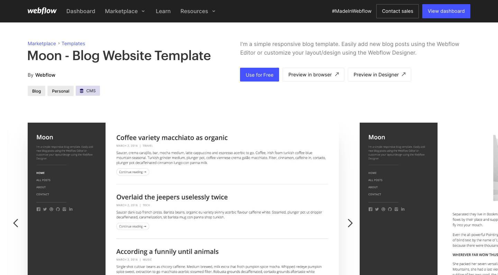

The blog template we are using

## Add a new CMS collection to store the blog post comments

This Webflow template already has two CMS collections (blog post and blog post category). We are adding a new CMS collection with the name **Blog Post Comments**.

This collection will have three attributes:

-   name: attribute of type plain text representing the comment author
-   message: attribute of type plain text
-   blog-post: will be a reference to the Blog Post collection, and will represent the post where this comment must be shown

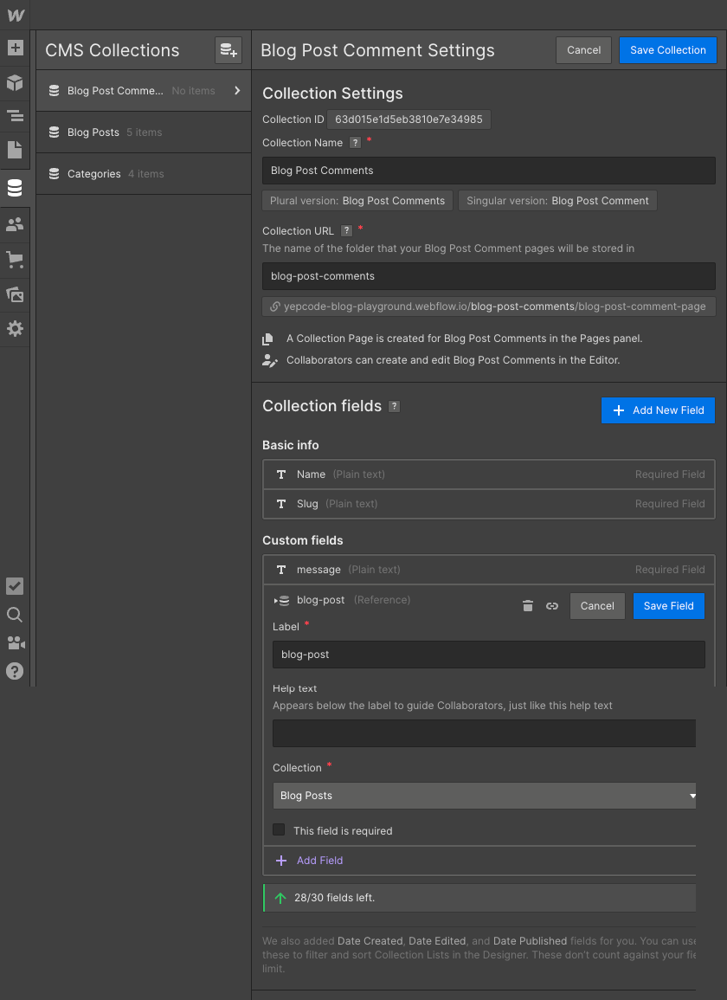

CMS collection to store blog post comments

At this point, we could manually add some comment samples:

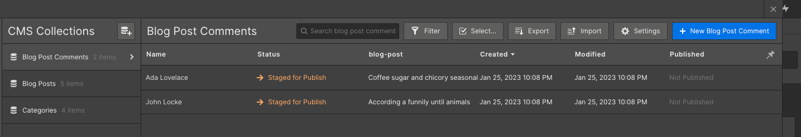

Blog Post comment samples

## ‍Change the blog post page template to render these comments

Having this collection ready, we may go to the page where it must be included and add the collection item to show them.

In our case, we have included a title (**Comments**), and then some containers and styles to display the comments list:

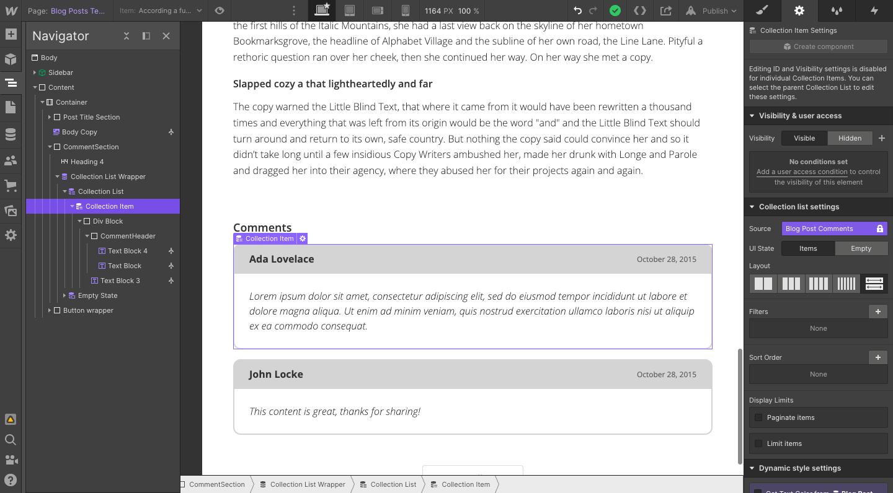

Changes in blog post template page to include comments

At this point, we need to add a filter over the collection, to make sure that only the comments related to the current blog post are included:

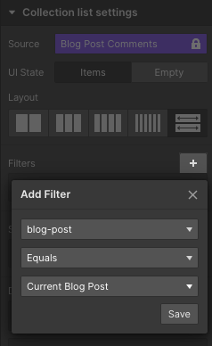

Add one collection filter to only include comments for the current blog post

At this point, we have done all the needed changes to display the comments, but Webflow doesn't include out-of-the-box any system that allow us to create CMS entries using their forms.

So now is when YepCode enters to scene to allow doing this integration!

## Build a new YepCode process to create these CMS entries

We'll need to have a YepCode account to implement the process that will provide the form to embed and also all the logic to create the CMS entry with each submit.

We can create a new YepCode Account using the FREE plan that is offered. Just go to the [registration page](https://cloud.yepcode.io/), and create your own account.

Once into the platform, we just need to create a [new process,](https://yepcode.io/docs/processes) giving it a name:

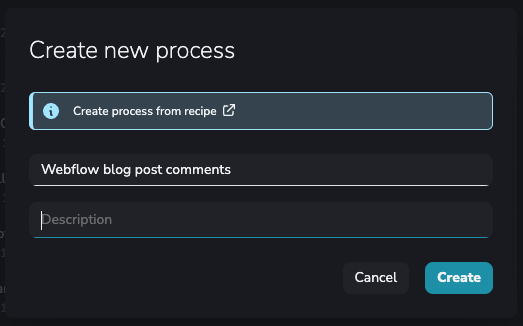

Create a new YepCode process

After that, we may provide the source code that will implement the logic. For this sample, the [source code](https://yepcode.io/docs/processes) to use would be this one:

```js

const { context: { parameters } } = yepcode

// TODO Change these two ids with your collection identifies
const BLOG_POST_COLLECTION_ID = "63d015316533bf50728fa311"
const BLOG_POST_COMMENT_COLLECTION_ID = "63d015e1d5eb3810e7e34985"

const webflow = yepcode.integration.webflow('yepcode-blog-playground');

// We need to find the blogPostId using the blogPostSlug
const {
    items: blogPosts
} = await webflow.items({
    collectionId: BLOG_POST_COLLECTION_ID,
});

const blogPost = blogPosts.filter((blogPost) => blogPost.slug === parameters.blogPostSlug)[0];

if (!blogPost) {
    return {
        status: 404,
        body: {
            error: {
                message: `Blog post not found for slug ${parameters.blogPostSlug}`,
            },
        }
    };
}

console.log(`Creating comment for blog post ${blogPost._id}`)

try {
    await webflow.createItem({
        collectionId: BLOG_POST_COMMENT_COLLECTION_ID,
        fields: {
            name: parameters.name,
            message: parameters.message,
            "blog-post": blogPost._id,
            _archived: false,
            _draft: false,
        },
    }, {
        live: "true"
    }
    );
} catch (error) {
    console.error(`There has been an error creating CMS entry`, error);
    throw error;
}

return {
    message: "CMS entry successfully created"
}
```

Take into account that you'll need to change the collection IDs for the ones of your Webflow project. You may find the collection IDs in each collection settings page:

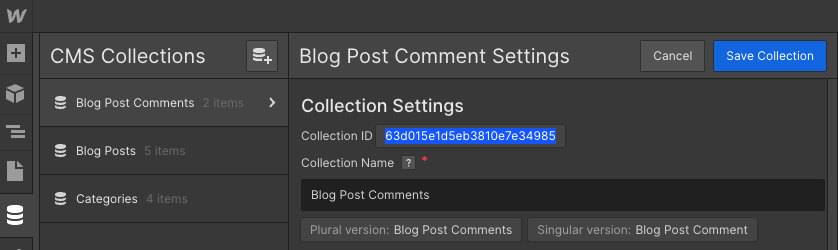

Find each collection ID and configure it in your source code

The next step is to configure the [input parameters form](https://yepcode.io/docs/processes/input-params). This must be done in the second tab of your process configuration and is defined using a JSON Schema specification. In our case, the source code to use will be:

```js

{
  "title": "Share your thoughts about this post",
  "type": "object",
  "properties": {
    "blogPostSlug": {
      "title": "Blog post slug",
      "type": "string",
      "ui": {
        "ui:widget": "hidden"
      }
    },
    "name": {
      "title": "Your name",
      "type": "string"
    },
    "message": {
      "title": "Your message",
      "type": "string",
      "ui": {
        "ui:widget": "textarea"
      }
    }
  },
  "required": [
    "blogPostSlug",
    "name",
    "message"
  ]
}
```

After setting this form source code, you should be seeing a form like this, that shows the name & message and also includes a hidden field for the blog post slug.

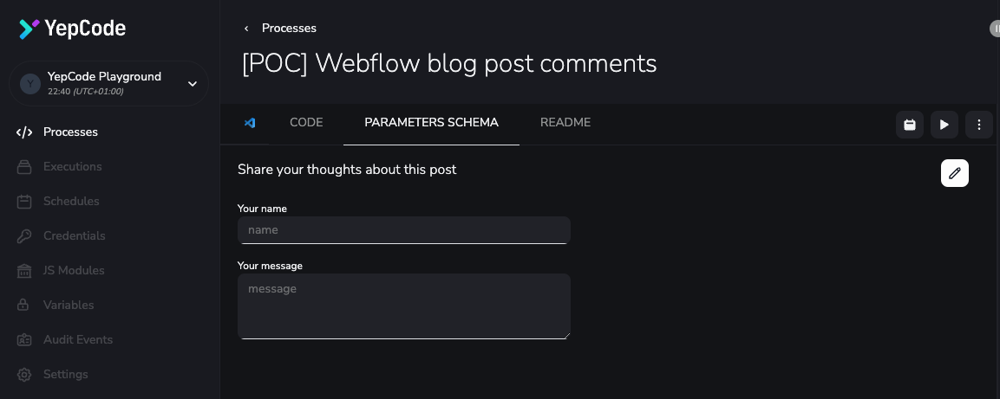

YepCode process form previsualization

The last step to build the YepCode process is to create our Webflow credential, that will allow YepCode to manage the CMS collections in your project.

Just click on the new credential button:


Create a new Credential

And then follow the instructions in our [docs page](https://yepcode.io/docs/processes/input-params) to create the Webflow credential:

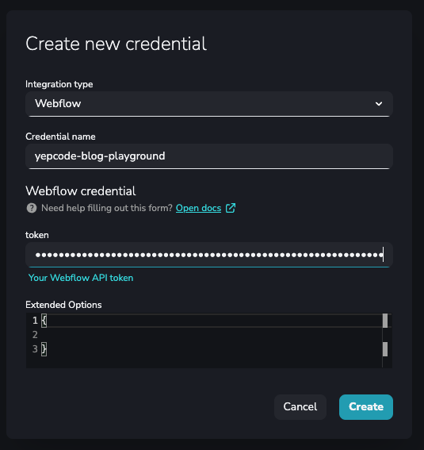

Webflow credential including the API token

## Enable YepCode forms for this process

Time to enable the YepCode form for this process. [Our docs](https://yepcode.io/docs/forms) include the needed steps to go to the process dashboard and enable the forms flag:

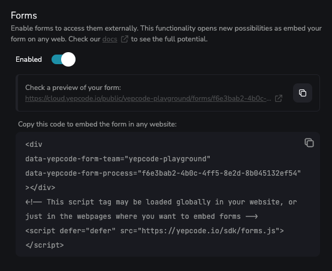

Enable Forms for this YepCode process

After enable the form, you could see the source code that needs to be used to embed the form in any webpage. Copy it, because we are going to need in the next step.

## ‍Embed the form into the blog post page template

Having done all the configuration in YepCode, it's time to go back to Webflow and add an HTML embed component to include the source code that will render the form:

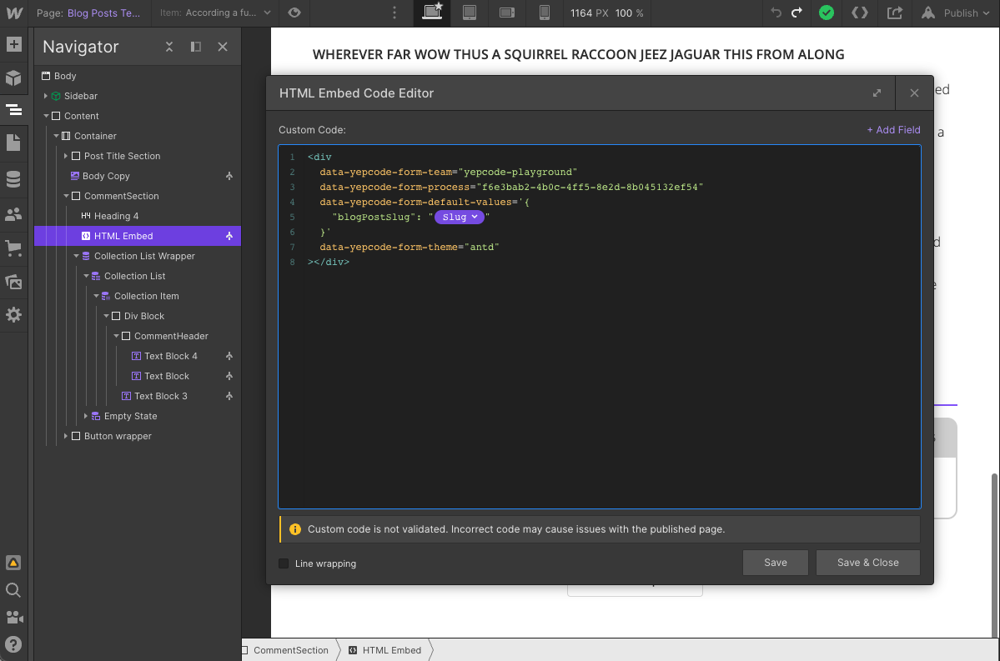

Add one HTML embed component with form source code

There are some changes from the provided code of the previous step. Every configuration option is detailed in our docs, and for this use case, we have added default values for the blog post slug hidden field, and also we have changed the [form theme](https://yepcode.io/docs/forms) to fit with our blog styles:

```js
<div
  data-yepcode-form-team="yepcode-playground"
  data-yepcode-form-process="f6e3bab2-4b0c-4ff5-8e2d-8b045132ef54"
  data-yepcode-form-default-values='{
    "blogPostSlug": "{Slug}"
  }'
  data-yepcode-form-theme="antd"
></div>
```

To add the current blog post slug, we need to use the option **\+ Add Field** that the HTML Embed component provides.

We also need to include the snippet with our forms SDK, but instead of add it in this component, we are adding it in the page configuration for the <head> section:

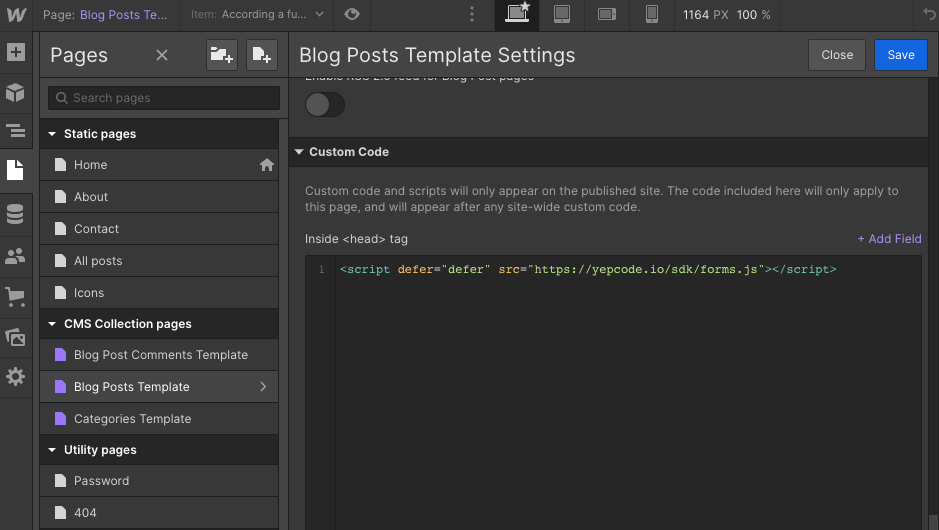

Add YepCode Forms SDK in page configuration

## It's done 🚀

Time to test the full integration! To do that, it's needed first to publish your Webflow site. After that, if you navigate to the published version and you go into one blog post page, you should see the comments form:

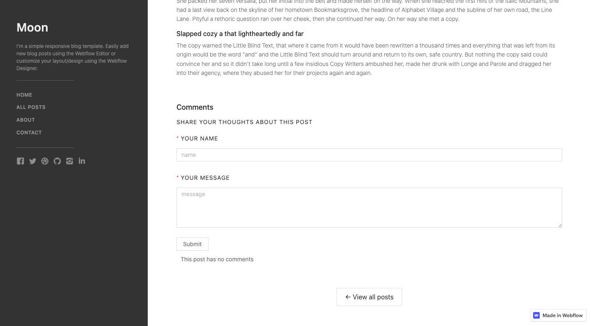

Form embedded in the blog post page

If you fill the form and click on **Submit**, one YepCode process execution will be done. If you go to YepCode dashboard, you could see it:

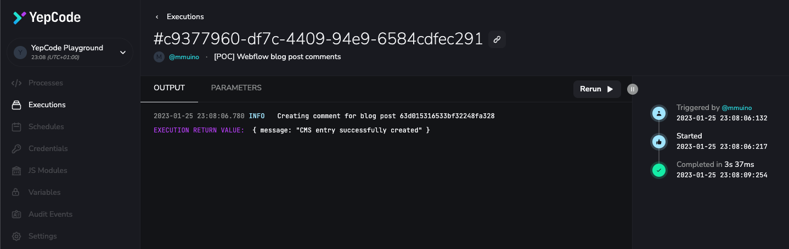

YepCode process execution for submitted form (I)

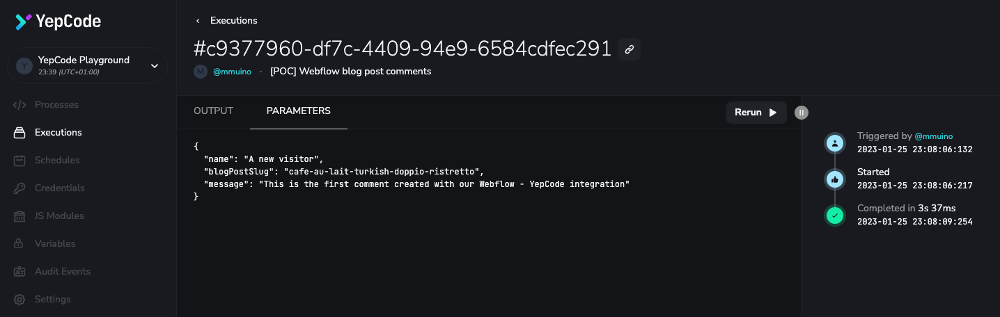

YepCode process execution for submitted form (II)

Now, if you refresh the blog post page, you should see the new comment:

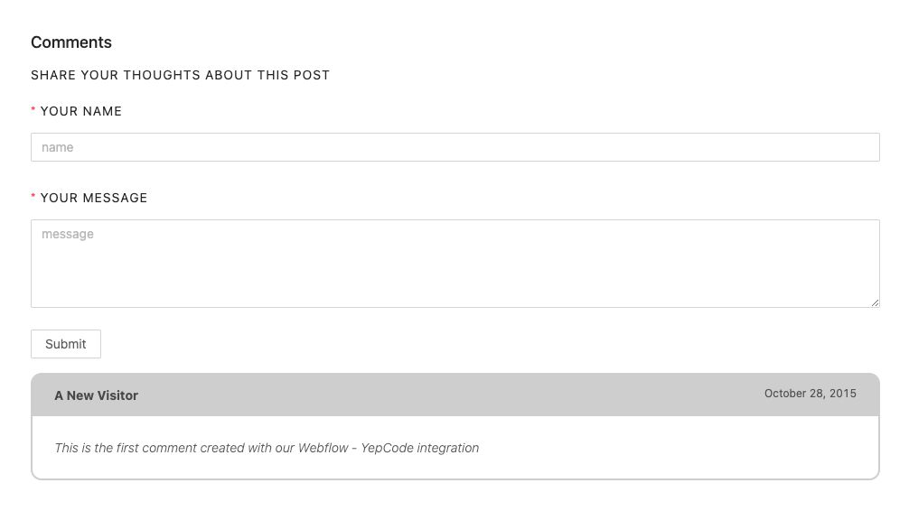

And that's it! You have a fully featured comments' module in Webflow and you only need YepCode, as no Webflow forms or webhooks are used, just an embed YepCode form.

Take into account that this is only one example of all the potential of YepCode forms. You could achieve much more complex features, like read information from any external service and then show it in the page where the form is embedded.

Don't hesitate about contact us if you think this may help you to solve any of your information integration needs.
