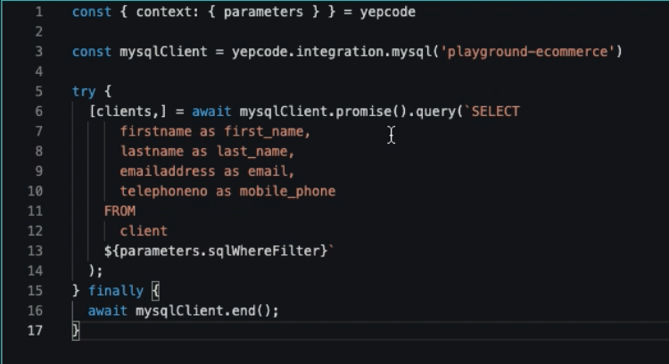

If you want to **sync your Apollo.io with your database**, you will probably run into some issues that may make this task not as simple as it seems. Especially if you want to **automate this process to keep this database up to date** as new contacts are made.

In this case, we'll show you a complete implementation of a process inYepCode, **from account creation to fully working**.

The process will consist of creating an integration that **retrieves information from an eCommerce database** (in this case, a **MySQL server**) and using a **REST API, uploading the retrieved information to Apollo.io.**

### **But first of all, what is Apollo.io?**

[**Apollo.io**](https://www.apollo.io/) is a sales intelligence and engagement platform which allows you to **search and store new contacts to improve your B2B salesprocesses**. It also lets you **automate emails**, calls, and tasks to maximize efficiency and speed up your sales.

With Apollo, you can **search for new contacts** as you can **connect to LinkedIn to find verified email addresses and phone numbers**. You can also store them in your database and sync them directly with your CRM.

### **What is the starting situation for having to sync Apollo contacts with our database?**

Our initial situation is this: We have an **e-commerce database** with the information of our clients.

We want to have that **information in our Apollo account, to set up some email automation sequences** to send those customers new product offers.

Also, in this process, we want to **deliver an email report with the contacts uploaded.**

So to show how to implement a full process in YepCode we are going to **build the process from scratch** by creating a brand new YepCode account.

### **Let's go to the process.**

Once we've created a new account, you can see there are some sample processes you can interact with, but we're going to **create a new one.**

This process will **query the database**, **upload the logs** using the Apollo.io API and **send the e-mai**l with the processed information.

So, we are going to start by giving the process a name and description.

Next, we need to **write the source code** for the process, **configure the input parameters** and we can also **write some documentation** for the process in a 'markdown' format.

The first step here is to **retrieve the client's information from our database**. We are going to **build a flexible approach by requesting an SQL filter to build the query to retrieve our clients.**

> This integration would take hours to be implemented and would be very difficult to do with a nocode tool.- Marcos Muíño (YepCode founder)

We need to go to our [**parameters schema configuration**](https://docs.yepcode.io/processes/input-params). You can use some **snippets** to see the **JSON schema** that allows us to build the form but we already have the sample pre-build.

At this point, we are going to ask for the “SQL wherefilter”. With a default value which filters by country and limit.

Having this filter configured, in the source code we **need to access the YepCode parameters**. (As you can see, YepCode has some Snippets integrations).

Here we have our **MySQL client** and we need to provide **credential** information. In this case, we are going to play with a playground credential.

In our **documentation**, you can find all the necessary information to know how to build that **credential connection**.To configure the **MySQL credential**, we will go to the credentials section and create a new one. We'll provide the name, our host, the user, also the password, the database and finally the port.

The next step will be to **retrieve the clients from the database**. As we have seen before, we already have the SQL filter, so our **source code** could be something like this.

Now that we have the client, we will **build a query against our database client**. We will also **add the SQL filter** and then close the connection.

If we run this process, we will see the retrieved clients from our database.

### **Uploading the information to the Apollo account**

Our next step will be to **upload the information to the Apollo** account.

To achieve this, we are going to **add a new execution parameter** with the Apollo list where we want to store the new contacts.

So we add a new parameter that we will call 'apolloContactsList'. And when we're done, we'll see **another input parameter with a default value.**

Now we need to **configure the credentialfor the Apollo.io API**, which will be an [**Axios**](https://docs.yepcode.io/integrations/axios) one. We provide the name, the base URL and some **HTTP headers**.

We can now use our credentials to **iterate over the retrieved clients in the MySQL database.**

For each client, we will display the first name & last name in the console log and then perform a **‘post’ request against the Apollo API**.

We need to provide the APOLLO.IO API KEY. The Apollo authentication can receive the API KEY as a query param.

### **Now, we'll create a variable**

So we are going to use another YepCode feature, which is the [**Variables**](https://docs.yepcode.io/processes/team-variables).

We will create a new one with the name **APOLLO.IO API KEY**. Then we have to go to our Apollo account. In the integrations section, in the API, we will copy our key.

We will then **place it in the Apollo environment variable**.

We are using the **contacts method** as you can see in the documentation where you also find every single piece of information.

Once this is done, we can try another execution to check that everything is ok.

For example, we are going to filter by SPAIN and only ask for four records. We can verify that all four contacts have been uploaded.

If we now go to our Apollo account, we can see that **a new list has been created** and it has the four contacts that we have found in our database.

### **Setting up the e-mail report delivery**

To **send the e-mail report**, we need to **create a new credential** (in this case an **SMTP server**), and then write the code to deliver the e-mail with the desired content.

So we will start **configuring the Nodemailer credential** by introducing a server (in this case we’ll use **MailCatcher**) that will allow us to perform some tests against mail servers.

If we go now to our process we need to deliver the e-mail. We could use some snippets but we already have the source code here.

We will **set up the Nodemailer credential** and then we are going to build the e-mail that we want to deliver.

These **e-mail addresses** could also be configured in the input parameters, but for this case, **we already have them in the source code**.

We can try another execution, filtering, for example, by Japan and showing us seven contacts.

If we now go to our 'MailCatcher' we can see **the mail and the new contacts**. We can also see each contact with their address in Apollo.

This integration could be implemented for any business need, forgetting all the tasks related to the systems infrastructure.

### **Additional settings**

Once the whole process is done, we could configure a [**periodic execution**](https://docs.yepcode.io/executions/scheduled) but it would be necessary to make some changes in the source code to load only clients not previously loaded.

Another interesting approach would be to [**configure a webhook**](https://docs.yepcode.io/executions/webhooks) that allows this execution to be started from other systems.

### **Implementing the inverse process**

Implementing the **inverse process** would be quite straightforward. So we are going to **retrieve the Apollo contacts and then transfer them to our MySQL database**.

The **input parameter that we are going to use is a keyword**. We are going to ask the user for a keyword that would be used to search contacts in Apollo.

The source code for this process will be quite similar to the previous one.

We retrieve the YepCode parameters. **We will need the Apollo integration** but we don’t have to define it again cause we already have it from the previous process.

Now we **perform a search request**. (You could see in the Apollo API where this search method is available.)

We are going to use the **contacts search method** that allows us to provide some keywords that will be the ones from the parameters.

Having the Apollo contacts downloaded, we **start the MySQL credential** and we perform the insert in one existing database.

We will run now one execution, for example with YepCode with five contacts. We will create each row with the email and the name. **Then we will store the full JSON content** that Apollo provides us.

We can try another execution with 11 contacts and then we can find them in Apollo.

This is a sample of how to use [**the full power of YepCode**](https://yepcode.io/yepcode-universe/an-overview-of-yepcode-technology-stack/) to solve your integration and automation needs.

Remember that our [**Docs platform**](https://docs.yepcode.io/) includes every single detail to make the most out of YepCode,

Enjoy the video and...

Happy coding! 🧑‍💻
