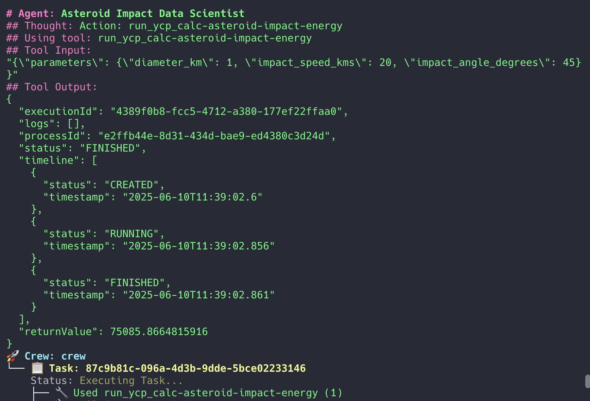
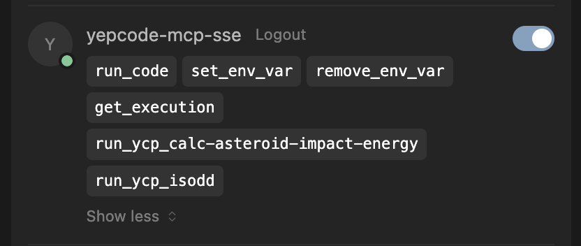

> **Turn your code into AI-powered tools.**

YepCode MCP tools let you turn any Python or JavaScript function into a cloud-powered action—designed to be executed by any AI platform (like Cursor, Claude, or OpenAI) once your MCP server is configured and accessible.

_If you can code it, you can make it a tool—data processing, API calls, or real-world actions. The possibilities are endless, especially when LLMs can trigger your logic on demand._

In this post, you'll learn how to:

-   Build a custom MCP tool in YepCode
-   Define its inputs and outputs
-   Use it from automations or with frameworks like crewAI

For more about MCP tools, see the [official documentation](https://modelcontextprotocol.io/docs/concepts/tools).

### **Why MCP Custom Tools?**

YepCode MCP tools are more than just code—they're reusable, cloud-executed functions that can be called from anywhere, by anyone (or anything) you authorize.

-   ‍**Reusable:** Write your logic once, use it in many workflows or projects.
-   **Cloud-powered:** No need to redeploy or manage infrastructure—just update your tool in YepCode.
-   **Empower LLMs and agents:** Let AI models and automations trigger real-world actions, not just make suggestions.

> Imagine an LLM that can not only answer questions, but also fetch data, run calculations, or trigger workflows—MCP tools make this possible.

> With MCP tools, your code becomes a living API—ready to power automations, agent workflows, and LLM-driven solutions.

### **Prerequisites**

Before you start, make sure you have:

-   A [YepCode account](https://cloud.yepcode.io/) (free tier is enough)
-   Basic Python or JavaScript skills
-   An idea for a tool (e.g., a calculation, API call, or data transformation)

> No local environment or server setup required—everything runs in the cloud!

### **Step-by-Step: Creating a YepCode Custom MCP Tool**

Follow this checklist to create your first MCP tool:

1.  Create a new process in YepCode ([official docs](https://yepcode.io/docs/processes))
2.  Add your logic in Python or JavaScript
3.  Define your input and output parameters
4.  **Add the** `mcp-tool` **tag** in the process settings
5.  Save and version your tool as usual

> If you don't tag your process as `mcp-tool`, it won't show up as a mcp tool for LLMs or agents to use!

Now your tool is ready to be discovered and called by AI agents, automations, or LLMs.

#### **Example: Asteroid Impact Energy Calculator**

> You can edit and test your tool right in the YepCode web UI. Copy-paste this code and try it with your own parameters!

Here's a Python example that calculates the energy released by an asteroid impact, given its diameter, speed, and angle.

**Parameters:**

-   `diameter_km` (float): Asteroid diameter in kilometers
-   `impact_speed_kms` (float): Impact speed in kilometers per second
-   `impact_angle_degrees` (float): Impact angle in degrees

This tool will return the estimated impact energy in megatons of TNT, or a helpful error message if any parameter is missing.

**Parameter Schema (JSON):**

This is how you define the tool's input parameters in YepCode:

#### Testing Your MCP Tool with crewAI

Once you've configured your MCP server and created your tool, testing it with crewAI is straightforward.

-   Follow the steps in the [related blog post](https://yepcode.io/blog/crewai-yepcode-mcp-multi-agent-workflows) to set up an example with crewAI.
-   Your new MCP tool should show up automatically in crewAI's available tools list.
-   Agents will use your tool as needed, based on their configuration and tasks.

To test it, you just need to run:

_crewAI run output using your custom MCP tool._

#### **Testing Your MCP Tool in Cursor**

Now let's connect your new MCP tool to an AI platform! Here's how to configure the YepCode MCP server in [Cursor](https://cursor.so) so your tool is available to LLMs and automations.**Get your YepCode MCP server URL and API token:**‍

-   Go to YepCode Cloud > Settings > API credentials to create a new API token.
-   Your MCP server URL will look like: `https://cloud.yepcode.io/mcp/<your_api_token>/sse`‍
-   For more details, see the [YepCode MCP server repo](https://github.com/yepcode/mcp-server-js).

> Don't forget to replace `<your_api_token>` with your actual API Token in the MCP server URL. Once connected, you'll see all the tools you have available!

### **Best Practices**

-   Keep tools focused and atomic
-   Use descriptive names and docs
-   Handle errors gracefully

> **Pro Tip:** Keep your tools small and focused—one tool, one job—for easier maintenance and reuse.

### **Conclusion**

MCP custom tools in YepCode let you turn any code into a reusable, cloud-powered action—perfect for LLMs, agents, and automations.

> Curious to try this for your own API or use case? [Contact us](https://yepcode.io/contact) — we’d love to hear what you’re building.
