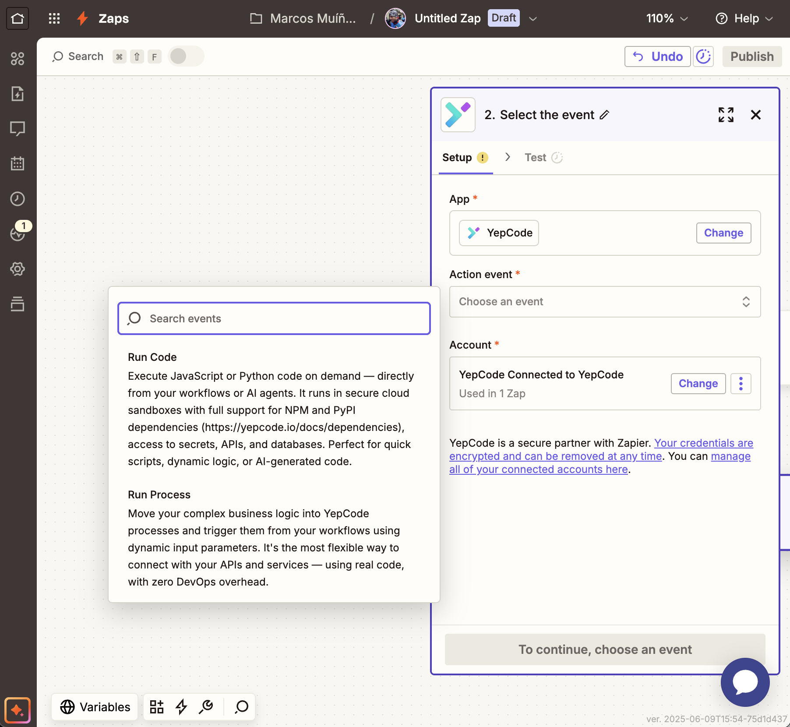
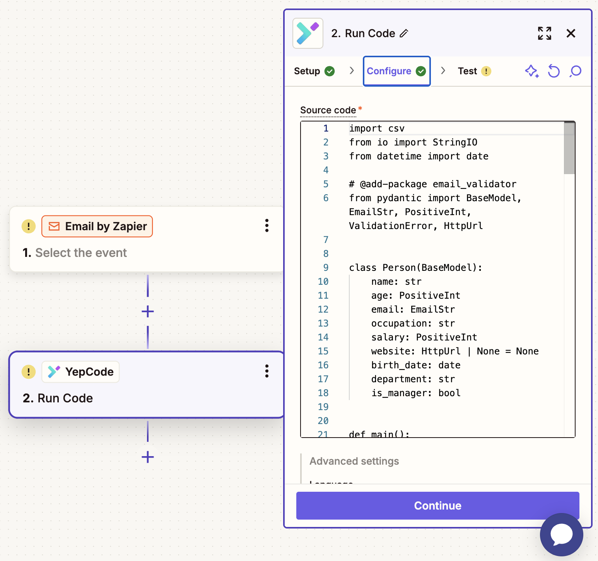
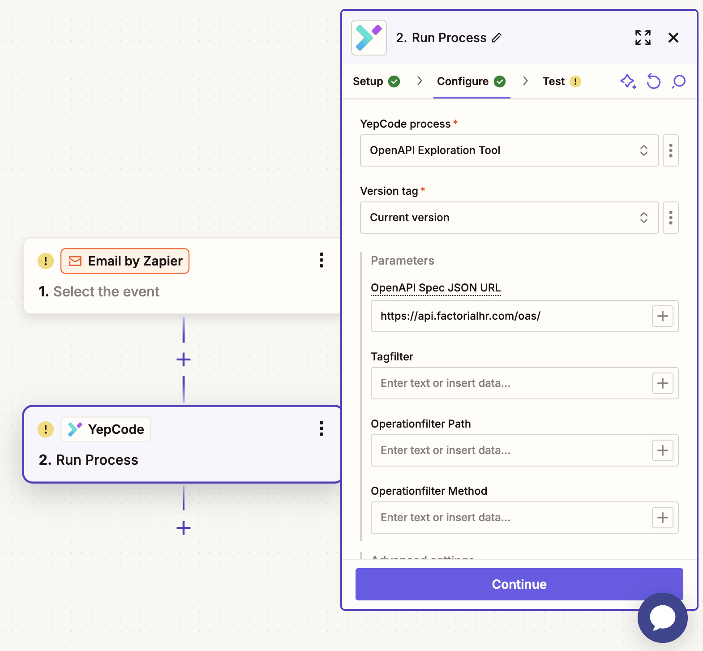
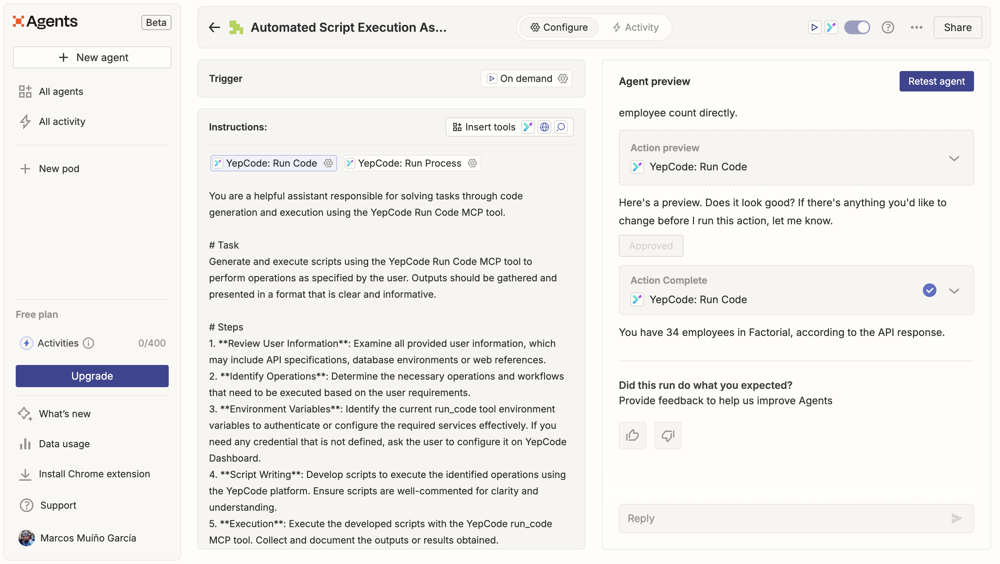

No-code tools are amazing — until they’re not.

You’ve been there: you’re building a Zapier workflow and hit a wall. You need to transform a payload, query a custom API, or run some logic that’s just too complex for built-in steps.

That’s exactly where **YepCode Run** comes in — and we’re excited to announce that it’s now available **directly inside Zapier** 🎉

Use the Run Code tool to execute any LLM generated code or the Run Process tool to start executions of your existing processes

### **⚡ What’s new?**

With the new [**YepCode Run connector**](https://zapier.com/apps/yepcode/integrations), you can now:

✅ Execute any custom serverless function right from your Zaps

✅ Define input parameters and map them easily from previous steps

✅ Use LLM-generated or prebuilt code to connect with APIs, query databases, transform files, and more

✅ Rely on any NPM or PyPI library — YepCode handles all the infrastructure and dependencies

This means **you get the power of full-code** without leaving the Zapier ecosystem.

Write or map your code from other Zap Step. You may use any NPM or PyPI dependency

Input parameters from your process are available in the Zapier connector to be mapped

### **🤖 Great fallback for AI agents**

If you’re exploring AI agents inside Zapier (like with OpenAI or Claude), this is a game-changer.

Let’s say your agent can generate the right script — but it needs somewhere to run it.

Now it can. Securely. Reliably.

With YepCode, agents get a powerful execution environment that makes it easy to go from suggestion to action — from “this is the code” to “done.”

Use the tools in your Zapier Ageents offering them a fallback option to solve unknown tasks

Use the execution results to rewrite the code and run it again

### **🔧 Ideal for:**

-   Custom API integrations
-   AI-powered automation
-   Data transformations
-   Workarounds when Zapier’s native actions fall short
-   Teams who need flexibility without building infra

👉 **Ready to give it a spin?**

We’d love to hear what you build — and we’re open to co-develop proof-of-concept automations for interesting use cases.

Let’s push automation further, together.

With YepCode, you’re always just one script away from unlocking anything.
